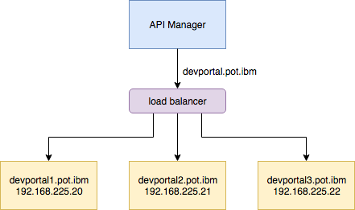

# API Connect (v5) Installation

This document describes the steps required to install an IBM API Connect on a VMWare Environnement (laptop or Server) for demo, dev or non-prod environnement. 

## System requirements

System requirement are available [here](https://www.ibm.com/software/reports/compatibility/clarity-reports/report/html/softwareReqsForProduct?deliverableId=F42A9D106C0111E7BF7508284238FC1F) 

These instructions use virtual appliances in VMware.

IBM API Connect requires three virtual appliances (API Gateway, API Manager and API Portal). 

Each of these appliances requires minimum of 4GB of RAM, so a machine with at least 16GB of RAM is required to leave capacity for other applications if you install all VM on the same machine.

In production, you would scale to use more than one of each appliance; however one of each appliance is sufficient for a demo cloud.

It is also possible to run API Connect in Bluemix as Software as a Service, but is not covered with this document.

## Download installation images

Always install the latest version of API Connect.  

GA images can only be downloaded from IBM Passport advantage, whereas fixes (including the .ova file for a fresh install) will be available on Fix Central.  

For complete installation, you need to download :
 
For **API portal**: 

* Download OVA with included fixes **5.0.8.1-APIConnect-Portal-Ubuntu16-20171030-1423.ova** : [here](https://www-945.ibm.com/support/fixcentral/swg/doSelectFixes?options.selectedFixes=5.0.8.1-APIConnect-Portal-Ubuntu16-20171030-1423.ova&continue=1)

 
For **API Manager** : 

* Download OVA with included fixes **APIConnect\_Management\_5.0.8.1\_20171030-0955\_4c09866eee14_ef24683.ova** : [here](https://www-945.ibm.com/support/fixcentral/swg/doSelectFixes?options.selectedFixes=APIConnect_Management_5.0.8.1_20171030-0955_4c09866eee14_ef24683.ova&continue=1)
	
 
For **API Gateway** :

* for no-production download OVA of IBM Datapower Gateway 7.6.0.0 no-production (The non-production version includes the required Application Optimization feature by default) : idg7600.noprod.ova

* for production download OVA of IBM Datapower Gateway 7.6.0.0 : idg7600.prod.ova
 
Download fixes **IDG-virtual-7.6.0.3-Firmware** :[here](https://www-945.ibm.com/support/fixcentral/swg/doSelectFixes?options.selectedFixes=IDG-virtual-7.6.0.3-Firmware&continue=1)

## Define Hosts and IPs

For this installation, all VMs are hosted on the same machine. 
 
The following static IP addresses will be used for the IBM API Connect appliances.  It is highly recommended that you follow the static addressing indicated in this document.  The subnet used is the same for both the API Connect and DataPower POT Assets.  A sample hostname structure is provided in the cha
 
```
# Manager
192.168.225.100	management.pot.ibm
# Gateway
192.168.225.52 	gateway.pot.ibm
# Portal
192.168.225.20	devportal.pot.ibm

```

It is required to set up host names from the perspective of your Host OS for each of your virtual appliance instances that are running in your environment (IP’s alone are no longer sufficient).  

If you are running on Windows, this is located in the C:\Windows\System32\drivers\etc directory.  
On linux, this found in /etc/hosts.  
On the mac, this can be found in /private/etc/hosts. 


# Start and set up virtual appliances

## API Gateway

*	Open the DataPower GA .ova file in VMware Workstation

> Note: See the Troubleshooting section if you get the error “Binary translation is incompatible with long mode on this platform. Disabling long mode “

*	Select a location for the virtual machine files (ideally in their own directory)
*	Accept the license
*	Wait for the import to finish (this will take several minutes)
*	Change the configuration on each Network Adapter from bridged to NAT.

>Note you only need to do this for eth0 and eth1, but it’s easier to do it for all 4 network adapters in case you want to configure more interfaces in future.

*	Review the CPU and Memory settings to ensure you will have enough resources to run both virtual machines. 

> Note that DataPower 7.x sets the defaults for 16GB RAM and 8vCPUs, so reduce these to 4GB RAM and 4vCPUs for a “Small” installation (For Dev or no-Prod installation). 

> **Warning** : If you need to apply iFix, set memory to 8GB RAM. You can reduce to 4GB RAM after the iFix is applied. 

*	Power on the virtual machine (it will take a few minutes to boot, but you can continue with the next steps while you wait)

## API Manager

*	Open the API Connect .ova file in VMware Workstation. 

> Note: See the Troubleshooting section if you have issues accepting the license or opening the .ova file directly.

*	Change the configuration on the Network Adapter from bridged to NAT
*	According to the API Connect documentation, the minimum supported configuration is 4GB RAM and 1CPU, however if you have restricted resources on your machine you could reduce these now to the amounts in the System requirements section.

*	Power on the virtual machine (it will take a few minutes to boot, but you can continue with the next steps while you wait)
 
## API Developer Portal

*	Open the Portal .ova file in VMware Workstation. 
*	Change the configuration on the Network Adapter from bridged to NAT
*	Default configuration of 2 vCPUs and 4GB of RAM is sufficient.  You can dial these requirements back if your machine 
*	Power on the virtual machine (it will take a few minutes to boot, but you can continue with the next steps while you wait)

# Configure

## Configure the API Gateway appliance

>Note: It is important to check that the IP Addresses are in the correct range for static IP addresses on your VMware NAT network adapter. 
Example ipconfig for VMnet8 that matches this range (if your ipconfig contains a different IPv4 address, replace the first 3 parts of the IP addresses above to match):
 
### Installation wizard

1.	Log into the DataPower virtual appliance with username “admin” and default password “admin”.
2.	Press any key to continue.
3.	Enter “n” to enable disaster recovery mode
4.	Enter “n” to disable common criteria compatibility mode
5.	Enter and confirm your new admin password
6.	Enter “y” to run the installation wizard
7.	Enter “y” to configure network interfaces
8.	Enter “y” to say you have all the information
9.	Enter “y” to configure eth0
10.	Enter “n” to disable DHCP
11.	Enter the eth0 IP address from the Static IP addresses section in CIDR notation, (192.168.225.52/24).  This assumes you are using NAT Addresses 
12.	Enter the IP address for the IPv4 gateway (192.168.225.2).
13.	Press enter to skip the IPv6 gateway address.
14.	Enter “n” to skip the eth1 configuration.
15.	Enter “n” to skip the eth2 configuration.
16.	Enter “n” to skip the eth3 configuration.
17.	Enter “y” to configure network services
18.	Enter “y” to configure DNS
19.	Enter “y” to say you have all the information
20.	Enter the IP address of the DNS server (same as the IPv4 gateway, 192.168.225.2)
21.	Enter “n” to skip defining a unique system identifier for this appliance
22.	Enter “y” to configure remote management access
23.	Enter “y” to say you have all the information
24.	Enter “y” to enable ssh
25.	Press enter to accept the default IP address (all IP’s)
26.	Press enter to accept the default port (22)
27.	Enter “y” to enable the WebGUI
28.	Press enter to accept the default IP address (all IP’s)
29.	Press enter to accept the default port (9090)
30.	Enter “n” to skip configuring a user account that reset passwords
31.	Enter “n” to skip configuring a hard disk array
32.	Enter “n” to skip reviewing the current configuration
33.	Enter “y” to save the current configuration
34.	Enter “y” to overwrite the previous configuration

**Important**: Do not log out of the console until you have logged in to the WebGUI and accepted the license (detailed in the next section). Otherwise, you have to work through the wizard again.

>Note: To check the IP addresses you configured earlier you can run the command “show int”

>Note: To check that AO is available and enabled you can run the command “show license” and look at “AppOpt”
 
### Accepting the license

1.	Navigate to the following URL in a browser: https://192.168.225.52:9090/ (use the eth0 IP address)
2.	Proceed through any security warnings about the self-signed certificate
3.	Log in with username “admin”, the new password you specified and the default domain.
4.	Click “I agree” to accept the license.
5.	The appliance reloads. The next time you log into the console, the wizard is not displayed.


 
### Configure NTP and timezone

It is required to configure NTP on every server to ensure the timestamps match and to avoid issues.  

Here is a NTP server for the FR . Others can be found by googling so just use one that is local to you.

It is also recommended to set every appliance to the same timezone to make it easier to compare logs.  

1.	Log back into the WebGUI of the Gateway with username “admin”, the new password you specified and the default domain: https://192.168.225.52:9090/ (it may take a few minutes for the appliance to reload before the WebGUI will be accessible again, refresh the URL until the login screen loads).
2.	Select Network > Interface > NTP Service from the menu on the left
3.	Set Administrative State to “enabled” 
4.	Set NTP Server = 51.255.197.148 (or other NTP server IP address) and click Add (For France : server 0.fr.pool.ntp.org, server 1.fr.pool.ntp.org, server 2.fr.pool.ntp.org, server 3.fr.pool.ntp.org)
5.	Click the Apply button
6.	Check that the object status changes to [up] at the top of the page.
7.	Select Administration > Device > Time Settings and select CET.
8.	Click Apply
9.	Select Status > Main > Date and Time and verify the correct time and zone is displayed.
10.	Click the Save Configuration link at the top right.

### Enabling the XML Management Interface Port

The XML Management Interface port must be enabled to allow IBM API Connect to configure the gateway server.

1.	Select Network > Management > XML Management Interface
2.	Set Administrative State to “enabled” 
3.	Set Local Address to the eth0 management IP address (192.168.225.52).  
4.	Keep the default port (5550)
5.	Click the Apply button and the object status should change to [up] at the top of the page.
6.	Click the Save Configuration link at the top right.

### Extend the Web Management Service idle timeout

This is an optional step that will stop you being logged out of the WebGUI after 10 minutes.

1.	Select Network > Management > Web Management Service
2.	Set the Idle Timeout to 6000 seconds or another large number of your choice.
3.	Click the Apply button and the object status should change to [up] at the top of the page.
4.	Click the Save Configuration link at the top right.

### Enabling statistics

The Statistics Service must be enabled in the Gateway Server to allow the Cloud Management Console to display resource utilisation information (more details in the Knowledge Center).

1.	Select Administration > Device > Statistic Settings 
2.	Set Administrative State to “enabled” 
3.	Click the Apply button and the object status should change to [up] at the top of the page.
4.	Click the Save Configuration link at the top right.

### Upgrading to the latest Fixpack (if required)

1.	If you need to update your DataPower OS, follow these steps otherwise, you can skip to the next section.
2.	In the DataPower WebGUI, select Administration > Main > System Control
3.	In the Boot Image section, click Upload and select the x*****.scrypt4 fixpack file.
4.	Click the Continue button once the file has been uploaded successfully.
5.	In the Boot Image section, ensure x*****.scrypt4 is selected, check the “I accept the terms of the license agreements” checkbox, and click the Boot Image button.
6.	Click the Confirm button in the pop up window (you can ignore the warning “Firmware does not contain supported feature 'DCO-Oracle'.” since this is not required for APIM), wait for the action to complete and then click Close on the pop up window.
7.	Wait for the system to reboot, and log back into the WebGUI (you can check the reboot output in the VMware console, the WebGUI should work once the login prompt is displayed).
8.	Verify the version has been updated on the bottom left of the navigation menu on the left side of the screen.

## Configure the API Manager appliance

Once the appliance is successfully started you will get a login prompt. The first time you power up the management server, it might reboot itself automatically.  Once it comes up again, you can log in.

2.	Login with username “admin” and default password “!n0r1t5@C” 

Enter the following commands to configure the networking and NTP.  

Alternatively, you can use whatever IP addresses work best for your machine.  

```
	Net set hostname static management
	Net set domain static pot.ibm
	net set eth0 address 192.168.225.100 mask 255.255.255.0
	net set gateway static 192.168.225.2 eth0
	net set nameserver static 192.168.225.2
	net set ntp static 51.255.197.148.  Where 51.255.197.148 is a sample NTP server. Here is a NTP server for the FR
	net set search none
	net restart
	net show all 
```

### Configure API Connect

At this point all appliances (API Gateway, API Portal and API Manager) should be started.

1.	Log into the Cloud Management Console: https://<management_server_ip>/cmc for example: https://192.168.225.100/cmc/

>Note: Sometimes It takes roughly 3-5 minutes for the cmc to come up after all of the system processes come up on the management server.  If the cmc page comes up blank, wait a few minutes and reload the page.  You can double check that all 3 key processes are up by typing “system show status” in the console window, but even if all are up it can take more time for the UIs to work.

2.	When the login screen pops up, log in with the default admin login & password ( Login: admin, Password: !n0r1t5@C )
3.	If the license is displayed, click Accept All Licenses, Terms and Notices
4.	You will be required to change the admin password to something else upon logging in for the first time.  Be sure to write it down.

>Note: You should enter the old password in the first box, the new password in the next two boxes, and your email address in the last one.

* Check the Management Cluster displays the correct IP address on the Home page. If the correct IP address is not displayed the system was not configured correctly during the initial boot (e.g. VM image was set to bridged and then changed to NAT after first boot).

> If this is the case run the following commands from the CLI & then go back to step 1 of this section: system clean apiconfig, system restart.  
> Note: you must type “yes” not “y” to confirm the system clean apiconfig command and afterwards the admin password will have been reset back to the default “!n0r1t5@C”.

You will need to set up a connection to an existing Email Server. 

* Click on the Settings button and then fill in the information in the setup email box at the bottom of the page. 
	>The email server is used to send emails, for example, when a new organization account is requested. On your Host OS, it is recommended to use a stubbed out SMTP Server like FakeSMTP.  

* Example with gmail settings.

```
	HOST NAME: <YourEmailHostName> (smtp.gmail.com)
	PORT: <YourEmailHostPortNumber> (465)
	USERNAME: Optional. If your email server requires you to authenticate, in the USERNAME field, enter the administrative user name for the SMTP server. (your gmail email address)
	PASSWORD: Optional. If your email server requires you to authenticate, in the PASSWORD field, enter the administrative password for the SMTP server. (your gmail password)
	SENDER ADDRESS: <EmailAddressForSendingEmails> (your gmail address)
	SENDER DESCRIPTIVE NAME: <DescriptionOfEmailSender> (e.g. My Sandbox Support)
```
* Click Save

> Alternate approach:  Instead of Gmail you can use Fake SMTP, which is a lightweight Java app that acts as mail server and is very easy to configure.  More info can be found here: https://nilhcem.github.io/FakeSMTP/


### Define your Gateway Service Hostname

* From the Top menu click on Services.
* Modify your gateway cluster settings by click on the cogwheel on the lower right hand part of the screen
* Enter in the Datapower hostname (not up) in the Address field

	> Since this is a demo system, load balancing can be left disabled and we will keep the default ports and SSL certificate.
* Click Save Service

### Add the Gateway server to the Cluster

Now it is time to add the DataPower gateway server to the gateway service.

* Click on the Add Server button in the Gateway section.
* Enter in the information for the gateway server.  

Use the details for the XML Management Interface (Address 192.168.225.52, Port 5550, DataPower admin username and password) except for the Network Interface field which should be the interface to use for API traffic (eth0).  The Name field is a free form text that will be visible in the Manage Servers Screen.

* Click Add when done.  
 
It takes a few minutes to add the server to the cluster.  E.g. it needs to create the domain and the requisite DataPower assets.  When it’s done, you’ll see the gateway server appear on the list

### Create your first Provider Organization

* Click on the Organizations button on the menu on the top menu of the CMC.  
* Click on the Add Organization button to create the providerorg. The Provider Organization would typically represent a department or project that would be defining APIs.
 
* Enter the Organization title and short name as well as the email of the owner.
* Once you’ve entered all the details, click Add.
* Copy and Paste the link into the browser or Click the link in your email to Activate your user account.

> **Note** : If you are having trouble getting the validation email, be sure to check the obvious things (smtp host is set properly, localhost does not work, must be the ip for the host machine that is running the vm’s).

> Additionally, you can extract the validation email from the logs that are generated from the CMC.  Go to the CMC, and then to the management node and click on download logs.  If you download the logs and then open up the tar file download and navigate to and open up the /var/log/cmc.out file.  Do a search on "email to" you can pull out the body of the validation mail that was sent and you can validate your user from there.  The easiest way around the email issue is to use FakeSMTP.  It will make your life much easier.

>Example: 
Email to: somemail@gmail.com, URL: https://10.91.25.19/cmc/?validate=true&authId=cmc%2F5527cc73e4b0b55fe4711add%2FI3xA3rT4oE2tW8jR0nM8tV0pI6mM7lW3tX2xU2tS0e&token=m5QfcGr3KHZacaZoC3TcnqffMGsNqJYefjHINu5Tmf&username=someemail%40gmail.com 

* Enter your user information and click Sign Up
* You will be automatically redirected to your org’s API Manager at https://<management_server_ip>/apim/ e.g. https://192.168.225.100/apim/
* Setup of the management node is now Complete


# Configure the Developer Portal

At this point both gateway and management appliances should be started and configured.   Also, ensure that the Portal VM is started already. 
 
* Using the VMware console, log into the advanced portal using the default credentials of admin/!n0r1t5@C
* Change the networking for the eth0 interface on the  portal by doing the following
* type in sudo vi /etc/network/interfaces
* We will be focusing on the following sections in this file
 
Change the Primary network interface information to the following:

```
	allow-hotplug eth0
	iface eth0 inet static
	address 192.168.225.20
	netmask 255.255.255.0
	gateway 192.168.225.2
```

> **Note** : You can comment out the two lines under secondary interface

* Save the changes made

You will need to recycle networking by typing the following (or reboot the VM):

```
	sudo service networking restart
	sudo ifup eth0
```
Add hostname entries for the management, gateway and portal into the /etc/hosts file on the developer portal

```
	sudo vi /etc/hosts
```
> **Note**: there is a tab between the IP address and the hostname below.


* Via your browser, connect to the CMC portal and log in as the admin user.  
* Go to the settings menu option.  
* Select the Developer Portal section from the side menu.
* Enable Developer Portal by moving the slider to the right
* Enter in the Portal Management Address -> 192.168.225.200

 

* Next, Copy the public key from the same section to the clip board
* Go to ssh session screen connected to API Portal VM, type the following and then paste the contents of the public key into the window
```
	echo contents_pasted_from_the_public_key_field" > key_file_name
```

* execute this command to set the apim host name
```
	cat key_file_name | set_apim_host devportal_host_name apim_cluster_address
```

>**Note**: the dev_portal_host_name needs to be the hostname of the Advanced Portal, which is devportal.pot.ibm. apim cluster address is the management node hostname.  In this case, its management.pot.ibm

* Configure the SMTP server to be used to deliver the validation URL for the admin user. To configure the SMTP server type the following:

```
	set_smtp mail_server_host_name port user password
```

* Type in 

```
	set_apim_cert –i.
```
This will cause the advanced portal to trust any SSL certificate served by the API Connect node. 

> **Note**: This should only be used for development and testing purposes as it is not secure and leaves the Advanced Portal exposed to a man-in-the-middle attack.

Now you can add your portal to your environment.  

You can either add it to your sandbox or create a new one and attach it to that. 

Be sure to use the hostname of devportal.pot.ibm with the https in front

* Click the save button.  This will create your initial environment. It will take a few minutes. 
 
> If you do not get the validation email, then you can go to your SSH window and type the following:
```
	Run 'list_sites' command.  
```
It will give output that looks like this.  The numeric value is the id of your portal site.  54f55f48e4b0dd983ce5c93c.54f55f48e4b0dd983ce5c93e => developer.pot.ibm

To get the link Run this command and copy and paste the numeric output of the previous command 'site_login_link 54f55f48e4b0dd983ce5c93c.54f55f48e4b0dd983ce5c93e'

The output from the previous step will give you a link.  

* Copy and Paste that link to your browser and finish setting up your Admin user

* Point your browser to the hostname of the Advanced Portal (devportal.pot.ibm).

You now can create your API consumer user by clicking on the **“Create New Account”** button.  Fill out the user form and it will give you a validation link.  This time it will be sent using the email server defined inside of API Connect (versus using postfix on the portal).  From there you can validate your user and finish the user setup process.

If you want to set up another advanced portal site that is tied to another environment, follow these steps:
* Create an entry on your hosts file for your laptop that points to the advanced portal machine that contains a unique host name for the portal i.e. 9.55.60.19 myuniquehost.api.com 
* In the API Manager UI, point your environment to the unique host name you set up in step 1. This will create your environment. It will take a few minutes to complete. 
* It should send an email link with the validation of the admin user in the portal.  Simply click the link to complete that.

> If however, for some reason that the initial email process that gives you the initial admin password reset link fails -  Use the following commands to get that link manually. -- Using a tool like putty, SSH over to the advanced portal image. Login using the admin/!n0r1t5@C credentials -- 
                Run 'list_sites' command <my output was> 54f55f48e4b0dd983ce5c93c.54f55f48e4b0dd983ce5c93e => developer.ibmapimdemo.com 
                Run 'site_login_link 54f55f48e4b0dd983ce5c93c.54f55f48e4b0dd983ce5c93e' 
                 -- The output from the previous step will give you a link. Copy and Paste that link to your browser and finish setting up your Admin user 

* Lastly, set up your Developer Org & User by pointing your browser to your unique hostname for your developer portal. This registration step uses the APIM Email facility, versus the Debian Linux one like the Admin user setup process does. You can then retrieve this mail and finish setup as normal.  


**This will complete the process** 
 
# Appendix A: Troubleshooting


# Appendix B: High availability


## High availability configurations for the Developer Portal

https://www.ibm.com/support/knowledgecenter/SSMNED_5.0.0/com.ibm.apic.install.doc/capic_portal_ha_config.html

To prevent database divergence, every functioning Developer Portal server prioritizes data consistency and calculates the total number of functional servers it can communicate with, divided by the total number of servers in the cluster. 

> The total number of functional servers includes the server that performs the calculation. 

**To enable a high-availability cluster, you need to configure a cluster with a minimum of three nodes**; this requirement is due to split brain detection in the database layer. Split brain detection works on a majority voting algorithm, therefore, at least three nodes are required to ensure that the remaining two nodes can detect that they are in the majority at 66% of the cluster. If a node in a cluster of two nodes loses communication with the one other node, then both nodes have only 50% of the cluster and so are not in a majority.


To set up a cluster of machines, complete the following steps :

- Define IP/Hostname/DNS/NTP/SMTP/Certs for each node
- Define Virtual IP

1 Dev Portal Cluster with 3 nodes :

- Portal 1 : devportal1.pot.ibm  192.168.220.20
- Portal 2 : devportal2.pot.ibm  192.168.220.21
- Portal 3 : devportal3.pot.ibm  192.168.220.22



For each node you want to cluster, do a standard setup for a stand-alone node, as in the topic Installing the Developer Portal (See "Configure the Developer Portal" section in this document) or here : https://www.ibm.com/support/knowledgecenter/SSMNED_5.0.0/com.ibm.apic.install.doc/tapim_portal_setup_cluster.html.

For each node update /etc/hosts with hostname and ip of other node

On the first node (for example devportal.pot.ibm) you want to cluster, enter the following command:

    set_cluster_members -c

Check status with the following command :

	status
	
If the status check is a success, you will receive a message that ends with the following line:

	SUCCESS: All services are Up and the cluster timestamps are in sync


Next add additional nodes to the cluster (devportal2, devportal3):

Log in to the new machine and enter the following command:

	set_cluster_members any_available_existing_cluster_member

For example 

	set_cluster_members devportal.pot.ibm
	
	
```
Found: devportal.pot.ibm(192.168.225.20)
Configuring cluster node
Trying the following list of cluster members to find a configured node: 192.168.225.20
Retrieving cluster configuration from 192.168.225.20 ...

You will be prompted for the admin password for 192.168.225.20 if you have changed
it from the default and the cluster is not yet completely configured.

Generating database server SSL cert and key
Adding DHParam to the server-cert
Server key and cert verified with CA certificate.
Enabling SSL for database replication traffic
Enabling SSL for database clients
Adding Mysql CA Cert for PDO
Stopping run_site_queue ...
Starting run_site_queue ...
Trusting host key for this IBM Developer Portal Node
SUCCESS: This member is now configured for the cluster
Got the cluster config from a configured node: 192.168.225.20
Generating new SSL key for csync2 on this machine
Creating new csync2 SSL certificate for this machine
Stopping lsyncd
Stopping lsyncd ...
Killing any csync2 client processes
Killing any csync2 client processes ...
Killing any run_csync2 client processes
Killing any run_csync2 client processes ...
apim_dcluster: Configuring Cluster Members for mysql: 192.168.225.20 192.168.225.21
apim_dcluster: Configuring Cluster Members for lsync: 192.168.225.20 192.168.225.21
apim_dcluster: Resetting csync2 databases ...
apim_dcluster: Configure /etc/lsyncd/lsyncd.conf.lua with 192z168z225z21 192.168.225.21
Stopping lsyncd
Stopping lsyncd ...
Killing any csync2 client processes
Killing any csync2 client processes ...
Killing any run_csync2 client processes
Killing any run_csync2 client processes ...
Started lsyncd
Restarting mysql ...
Waiting for database to be ready ...
2048-bit Diffie-Hellman Parameter already configured.
mysql server certificate is already using the correct Diffie-Hellman Parameter.
Updating Diffie-Hellman Parameter for database SST
Trusting the host keys of all cluster members
Setting QUEUE_RUN_STATUS to true
Flagging run_site_cron to force all sites to resubscribe to their webhooks with the new cluster member list

Full filesystem synchronization now running. This will take anywhere from 5-20 minutes depending
on cluster size/network speed/hard disk speed. Run 'status' to see when this has completed.
```

On each node Check status with the following command :

	status


Example :

```
admin@devportal2:~$ status
Operating System: Ubuntu 16.04.3 LTS
System version: 7.x-5.0.8.1-20171030-1423
Distribution version: 7.x-5.0.8.1-20171030-1404

Free disk space: 18G
 RAM Free/Total: 1843 MB / 3951 MB (46% free)
   Set Hostname: OK
     DNS Server: OK
   APIC SSH Key: OK
     NTP Server: OK
Cluster SSH Key: OK

Configuration:
  APIC Hostname: management.pot.ibm
  APIC IP: 192.168.225.100
  Devportal Hostname: devportal2.pot.ibm
  Devportal IP: 192.168.225.21
  APIC Certificate Status: INSECURE=1

Cluster members:
  192.168.225.20 is Active   (Primary)
  192.168.225.21 is Active   (Primary)
  192.168.225.22 is Active   (Primary)

Site web check: All sites OK

Site services:
         Webhooks: All sites Up
  Background sync: All sites Up

Services:
  Queue                      is Up
  Database   [Mysql]         is Up (Primary)
  Web Server [Nginx]         is Up
  PHP Pool   [Php7.0-fpm]    is Up
  Inetd      [Openbsd-inetd] is Up
  NTP        [Ntp]           is Up
  REST       [Restservice]   is Up
  File Sync  [Lsyncd]        is Up

Cluster timestamps:
  Cluster has 3 active out of 3 configured members. Current system time: Mon, 22 Jan 2018 12:37:55 +0000
  devportal2.pot.ibm => Mon, 22 Jan 2018 12:37:01 +0000 : 54 seconds behind
  devportal3.pot.ibm => Mon, 22 Jan 2018 12:37:01 +0000 : 54 seconds behind
  devportal1.pot.ibm => Mon, 22 Jan 2018 12:37:01 +0000 : 54 seconds behind
  
```  

### Test Your Cluster

- Stop the first node 
- On the second node check the status 

```
	status
```
```
Cluster members:
  192.168.225.20 is INACTIVE (Unreachable) <!>
  192.168.225.21 is Active   (Primary)
  192.168.225.22 is Active   (Primary)
```

Access to the Web site for Dev portal.

	https://<vip_of_portal>/<org>/<catalog>
