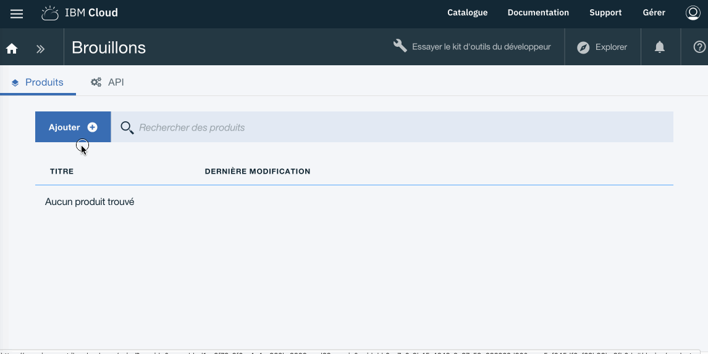
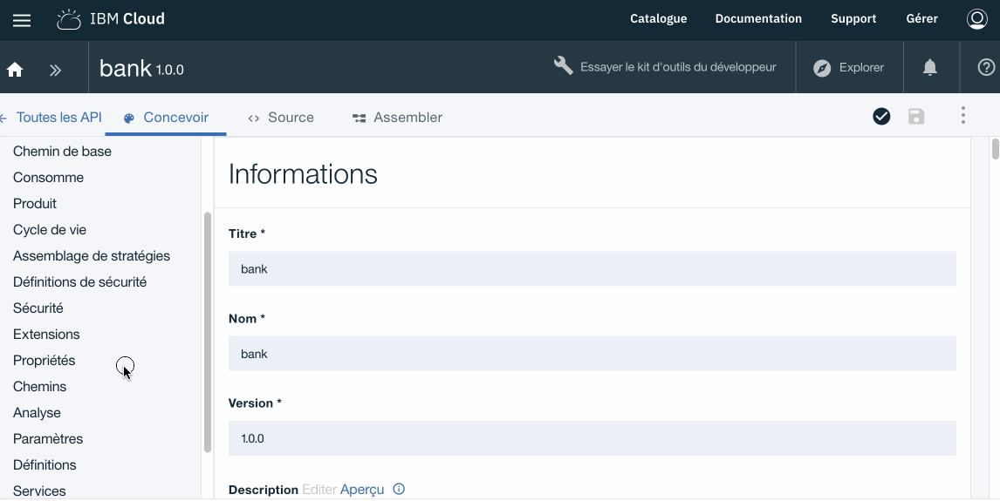
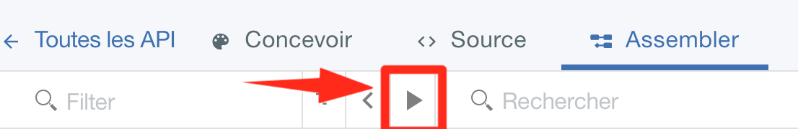
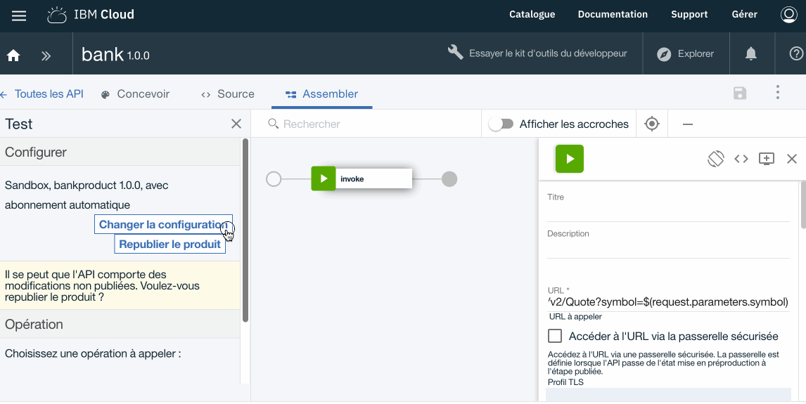
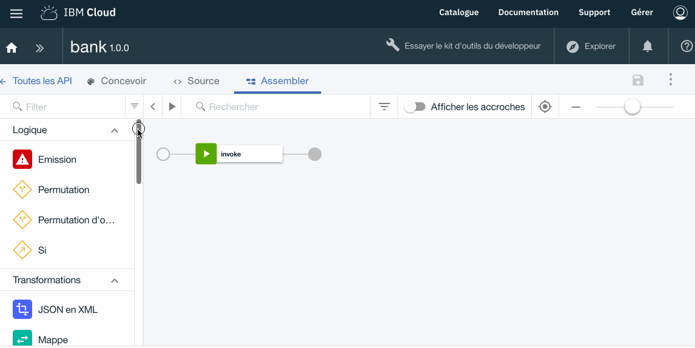
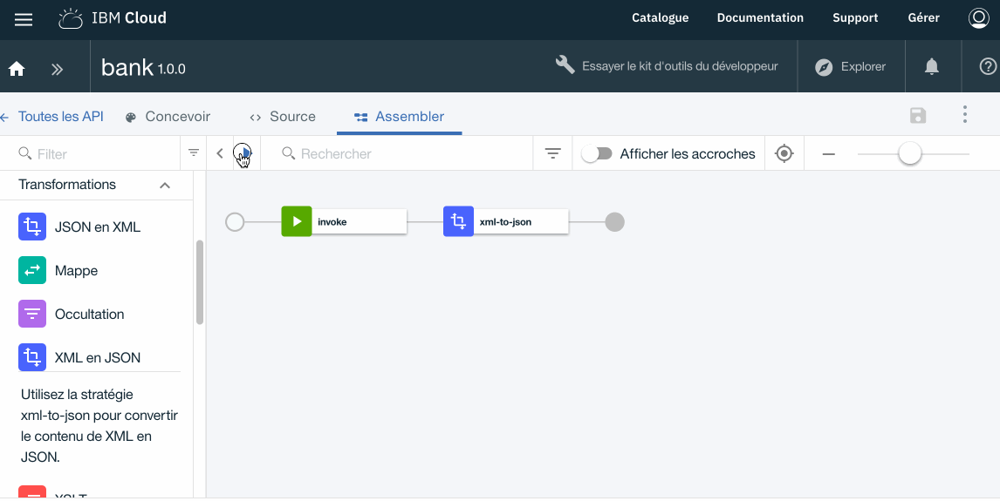

# Proof of Technology API Connect


## Lab 1 : Exposition d'une API Rest via API Connect

## Objectif 

> Imaginons que notre banque *(Bank A)* propose déjà des APIs REST en interne et qu'elle souhaite les exposer via une solution d'API Management.

>L'objet de cet exercice est de montrer comment exposer une API existante avec API Connect

> Afin d'illustrer cet exemple nous allons intégrer une API tiers nommé **Quote** et disponible ici : http://dev.markitondemand.com/MODApis/Api/v2/doc

> L'API **Quote** propose de retourner la valeur courante d'une action pour le nom d'une entreprise côté en bourse. 

```
Quote
http://dev.markitondemand.com/Api/v2/Quote
The Quote method requires the following input parameters

Field	Type	Description
symbol	String	Ticker symbol

When successful, the Quote method returns a serialized StockQuote object.
```


>Pour cet exercice nous allons travailler directement dans l'environnement "Bac à Sable" (Sandbox) de l'API Manager sur IBM Cloud.


- Ouvrir l'onglet "Brouillon" dans API Manager


## Créer un nouveau produit nommé : **bankproduct**
---

Dans le contexte de API Connect un **Produit** contient les informations suivantes :

* Informations contractuelles	d'usage des APIs
* La visibilité vis à vis des développeurs d'application
* Les API disponibles via ce produits d'API
* Les Plans associés. Incluant les notions de quotas et de monétisations des APIs disponibles via ce Produits d'APIs
* Catégories relatives aux APIs de ce Produit.


Cliquer sur ->  **Brouillon** *(Draft)* > **Produits** *(Product)* > **Ajouter** *(Add)* > **Nouveau produit** *(New Product)*

Compléter avec les valeurs ci-dessous puis cliquer **Créer un Produit**

Libéllé       | Valeur
------------- | -------------
Titre         | bankproduct
Nom			    | bankproduct
Version       | 1.0.0




## Créer une nouvelle API : **bank**
---

Cliquer ->  **Brouillon** *(Draft)* > **API** *(API)* > **Ajouter** *(Add)* > **Nouvelle API** *(New API)*

Compléter avec les valeurs ci-dessous puis cliquer **Créer une API**

Libéllé       | Valeur
------------- | -------------
Titre         | bank
Nom			    | bank
Chemin de base       | /bank
Version       | 1.0.0


Une fois dans l'onglet **Concevoir** *(Design)*

- Ajouter un **Chemin** *(Path)* nommé **/getQuote**
- Cliquer sur l'icone **+** et compléter avec les valeurs suivantes :

Libéllé       | Valeur
------------- | -------------
Chemin        | getQuote





- Ajouter le **Paramêtre** *(Parameter)* nommé **symbol**

> Rappelez vous que dans la description de l'API le paramêtre "symbol" doit contenir l'identifiant de la compagnie côté en bourse pour laquelle on recherche la valeur de l'action.
> http://dev.markitondemand.com/MODApis/Api/v2/doc

Cliquer ->  **Concevoir** *(Design)* > **Chemins** *(Path)* > **/getQuote** > **Ajouter un nouveau paramêtre** 

- Ajouter un Parametre

Libéllé       | Valeur
------------- | -------------
Nom			      | symbol
Situé dans    | requête *(query)*
Requis        | Coché
Type          | String


Une fois définit les éléments de l'API requis, il reste a finaliser les rêgles d'assemblage.

API Designer comporte une vue d'assemblage que vous pouvez utiliser pour créer des assemblages. 
Cette vue contient une palette qui répertorie les diférentes politiques disponibles (Logique, Transformation, Sécurité etc ...) .

Cliquer sur ->  **Assembler** *(Assemble)*


Par defaut un politique **invoke** est déja disponible. Nous allons juste la configurer pour pointer sur l'API "Markit On Demand" utilisée pour cet exemple.

Cliquer sur  **Invoke** et copier/coller, dans le champ URL dans le panneau de droite, l'url ci-dessous de l'API *Quote* de "Markit On Demand"

```
http://dev.markitondemand.com/MODApis/Api/v2/Quote?symbol=$(request.parameters.symbol) 
```


- **Sauvegarder** en cliquant sur l'icone en haut a droite 


La conception en l'API est maintenant terminé.

## Tester votre nouvel API : **bank 1.0.0**
---

- Cliquer sur l'icone **Test** pour ouvrir le panneau des outils de test.

 


- Selectionner le catalogue **Sandbox** (Selectionné par défaut)
- Selectionner le produit **bankproduct 1.0.0** (Précédèment créé)
- Cliquer sur **Ajouter l'API** *(Add API)*
- Puis **Suivant** *(Next)*

 

- Cliquer sur **Republier le produit** 
- Selectionner l'opération **get getQuote**
- Mettre comme valeur **IBM** (ou MSFT, AAPL) pour le paramêtre *symbol*
- Puis cliquer sur le bouton **Appeler**

Le résultat devrait avoir le forme suivante

```
<?xml version="1.0" encoding="UTF-8"?>
<StockQuote>
    <Status>SUCCESS</Status>
    <Name>International Business Machines Corp</Name>
    <Symbol>IBM</Symbol>
    <LastPrice>143.855</LastPrice>
    <Change>-0.055</Change>
    <ChangePercent>-0.0382183309</ChangePercent>
    <Timestamp>Mon May 7 10:27:17 UTC-04:00 2018</Timestamp>
    <MSDate>43227.4356134269</MSDate>
    <MarketCap>132054286640</MarketCap>
    <Volume>667933</Volume>
    <ChangeYTD>153.42</ChangeYTD>
    <ChangePercentYTD>-6.2345196193</ChangePercentYTD>
    <High>144.32</High>
    <Low>143.53</Low>
    <Open>144</Open>
</StockQuote>

```



> Si le message suivant apparait cliquez sur le lien et recomencer l'opération.
> 
``` 
Code de statut: -1
Aucune réponse reçue. Il se peut que CORS ne soit pas pris en charge sur le serveur cible, que le serveur ne soit pas disponible ou qu'un certificat non digne de confiance ait été rencontré.
Si vous cliquez sur le lien ci-dessous, le serveur s'ouvre dans un nouvel onglet. Si le navigateur affiche un problème lié au certificat, vous pouvez l'accepter et revenir ici pour procéder à de nouveaux tests.
https://api.au.apiconnect.ibmcloud.com/fdutorg-sydneydev/sb/bank/getQuote?symbol=IBM
```

## Ajouter une politique de transformation à l'API **bank**
---

Comme nous l'avons vu le format du message retourné par l'API **Quote** de "Markit On Demand" est du XML or les applications Web ou Mobile préférent manipuler des messages au format JSON.

Il est trés simple avec API Connect de transformer le format XML vers JSON avec la politique de transformation "XML en JSON"

Ouvrir l'API **bank 1.0.0**

- Cliquer sur ->  **Brouillon** *(Draft)* > **API** *(API)* > **bank 1.0.0**
- Cliquer ensuite sur l'onglet **Assembler**
- Sélectionner dans la palette la politique **XML en JSON**
- Puis faite un Déplacer/Poser de la politique **XML en JSON** juste derrière la politique **invoke**
- Et c'est tout ...

 

- **Sauvegarder**

## Tester la modification de l'API : **bank 1.0.0**
---

- Cliquer sur l'icone **Test** pour ouvrir le panneau des outils de test.

 


- Cliquer sur **Republier le produit** 
- Selectionner l'opération **get getQuote**
- Mettre comme valeur **IBM** (ou MSFT, AAPL)  pour le paramêtre *symbol*
- Puis cliquer sur le bouton **Appeler**


Le résultat devrait avoir le forme suivante (maintenant au format JSON)

```
{
  "StockQuote": {
    "Status": {
      "$": "SUCCESS"
    },
    "Name": {
      "$": "International Business Machines Corp"
    },
    "Symbol": {
      "$": "IBM"
    },
    "LastPrice": {
      "$": "143.691"
    },
    "Change": {
      "$": "-0.219"
    },
    "ChangePercent": {
      "$": "-0.1521784449"
    },
    "Timestamp": {
      "$": "Mon May 7 11:08:43 UTC-04:00 2018"
    },
    "MSDate": {
      "$": "43227.4643865741"
    },
    "MarketCap": {
      "$": "131903739888"
    },
    "Volume": {
      "$": "1102960"
    },
    "ChangeYTD": {
      "$": "153.42"
    },
    "ChangePercentYTD": {
      "$": "-6.3414157215"
    },
    "High": {
      "$": "144.32"
    },
    "Low": {
      "$": "143.29"
    },
    "Open": {
      "$": "144"
    }
  }
}

play_arrow
invoke
transform
xml-to-json


```



## Résumé
---
 
Durant cet exercice nous avons créer et tester une API dans API Connect.

Nous avons aussi vu comment utiliser des politiques dans l'outil d'assemblage.

Dans l'exercice suivant, Nous allons maintenant voir comment publier cette API (via son Produit d'API) et comment la consommer via une application Web.
 
## Continuer

Aller à - [Lab 2 - Publication et Portail Developpeur](/potfr/labs/lab02.md)

---
##### 2018 - Frederic Dutheil