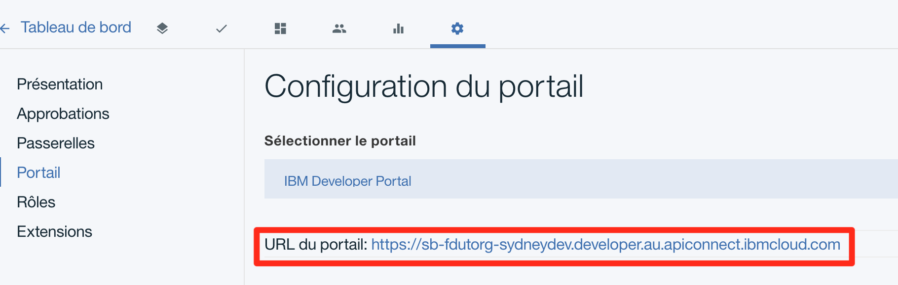

# Proof of Technology API Connect

# Lab2 : Publication et Portail Developpeur


## Fournisseur d'API : Publication 


> Nous avons créé une ou plusieurs API. L'objectif est maintenant de publier ces APIs pour être ensuite utiliser par des applications tierces.

> Les composants API Gateway, API Manager et API Portal interviennent ici.

> Pour Rappel :
> 
> - L'API Gateway expose les API aux consommateurs d'API 
> - L'API Manager déploi les produits d'API sur l'API Gateway et l'API Portal
> - L'API Portal permet au développeurs d'application de souscrire au Produit d'API.
 

< METTRE IMAGE ICI >


Pour cet exercice nous allons travailler directement dans l'environnement "Bac à Sable" (Sandbox) de l'API Manager sur IBM Cloud.


- Ouvrir le l'onglet "Brouillon" dans API Manager


### Configurer votre produit d'API

-- A COMPLETER --

### Publier un produit d'API dans le catalogue SandBox 

> Pour rappel : Un **catalogue** dans API Connect représente un ensemble de groupe de passerelles (Gateway) et d'un portail developpeur. Cela ressemble à un environnement mais il contient aussi une dimension business. Par exemple, les bons noms pour un catalogue sont Sandbox, Dev, Integration, Production, CRM (pour mes API CRM exposées à une population spécifique), etc ...

- Cliquer ->  **Brouillon** *(Draft)* > **Produits** *(Product)* >  **bankproduct**
- Cliquer ensuite sur l'icone **Publication** (le nuage en haut à droite)
- A ce stade l'API est publiée sur l'API Manager en état **pré-prodution**. Il n'est pas encore disponible sur le Portail Developpeur.
- Cliquer sur l'icone **>>** > **Tableau de bord** *(Dashboard)* > **Sandbox**
- Changer l'état **Mise en pré-production** en **Publier** en cliquant sur l'icone avec les 3 points verticaux et en sélectionnant **Publier**


Le produit d'API (qui inclut l'API **bank** et les rêgles d'utilisation des APIs contenues dans ce produit) est maintenant publié sur le Portail Developpeur et disponible pour les consommateur d'API.


## Consommateur d'API : le Portail Developpeur

En tant que développeur d'application je souhaite utiliser l'API **bank** depuis mon application.

- Se connecter au Portail Developpeur. Pour connaitre l'url du Portail Developpeur : Cliquer sur l'icone **>>** > **Tableau de bord** *(Dashboard)* > **Sandbox** > **Paramêtres** *(Settings)*> **Portail** 



- Dans le Portail Developpeur, cliquez sur le menu **Produit d'API**
- Le produit **bankproduct** doit être visible


Pour souscrire à un API nous devons créer un compte développeur (Consommateur d'API)

- Pour cela cliquer sur **Create an account** (en haut à droite) et remplisser le formulaire.

- Un message est envoyé dans la boite mail avec un lien pour l'activation du compte.

Exemple de mail

```
De: IBM API Connect <ibmapi@us.ibm.com>

Bonjour,

Merci d'avoir souscrit à l'accès aux API depuis sb.
Pour activer votre compte, cliquez sur le lien suivant :

https://sb-fdutorg-sydneydev.developer.au.apiconnect.ibmcloud.com/?q=ibm_apim/activate/x&activationToken=eyJ1cmwiOiJodHRwczovL2RldmVsb3Blci5hdS5hcGljb25uZWN0LmlibWNsb3VkLmNvbS92MS9wb3J0YWwvdXNlcnMvNWFmMTc3MGEwY2YyM2I5OGJjOTA2YTEyL2FjdGl2YXRlIiwidXNlcm5hbWUiOiIhQkFTRTY0X1NJVl9FTkMhX0FhVDJJSGxZQVBEenE4NHE1VUR3YkdHREtCYUlmei9tSXNEblZ3SXhlUkw0QUFBQUVDRktqcVhyMC8xUDRKWnFua3pPTEU5UHFiVlA5VGhTQ1AyMUgzWFQ4c2xPIiwiYXV0aGVudGljYXRpb24iOnsidXNlcm5hbWUiOiI1YWYwNDVkZjBjZjIzYjk4YmM4ZmIwZWEvNWFmMDQ1ZTAwY2YyM2I5OGJjOGZiMGViL3BIOHFUNW1RMW5IMmRDM3ZOMmtIMXhPMHJWNGVFNWlPOHFFNnlKMWRHNyIsInBhc3N3b3JkIjoianBhR3V5TTNKTlRLRkw4Z1pCZmZlWDVSSllIZHJDcUp3YXNiRTRneDVNIn0sInByb3ZpZGVyQ29udGV4dCI6eyJvcmdJRCI6IjVhZjA0NWRmMGNmMjNiOThiYzhmYjBkZSIsImVudmlyb25tZW50SUQiOiI1YWYwNDVkZjBjZjIzYjk4YmM4ZmIwZWEifX0

```

- Une fois le compte activer, connectez-vous avec le compte développeur.
- Avant de souscrire à une ou plusieurs API, il faut déclarer une application consommatrice des APIs.

- Cliquer sur **Créé une application** dans le menu et renseigner les valeurs suivantes :

Libéllé       | Valeur
------------- | -------------
Titre         | mobileapp
Description   | une application mobile

- Puis **Soumettre**


||| **IMPORTANT** 
> Copier/Coller les valeurs Client Id et Client Secret dans un editeur de texte. Ces valeurs seront nécéssaires pour consommer les APIs.

Libéllé       | Valeur
------------- | -------------
client id     | *************
client secret | *************


Il est maintenant possible souscrire aux API

- Cliquer sur **Produit d'API**
- Puis **bankproduct 1.0.0**
- Puis **S'abonner**


Nous pouvons alors tester les APIs dans le Portail Developpeur.

- Cliquer dans le panneau a droite sur l'API **bank**
- Puis sur l'action **GET /getQuote
- Sur le panneau de gauche, des exemples d'appel de l'API avec différents type de langage sont disponible.
- Aller dans la section **Exemple de demande**
- ID Client a été renseigné par defaut.
- Rensigner le paramêtre symbol avec la valeur **IBM** et cliquer sur le bouton **Appeler une Opération**


## Synthése
Durant cette exercice nous avons vue comment publier un produit d'API, souscrire à un produit d'API dans le Portail Developpeur et enfin tester une API dans ce même portail.

---

2018 - frederic_dutheil@fr.ibm.com