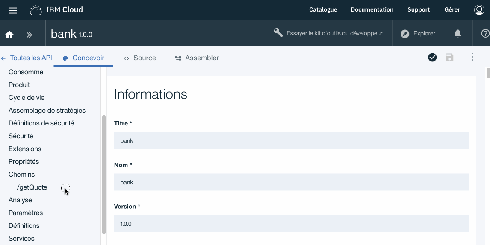
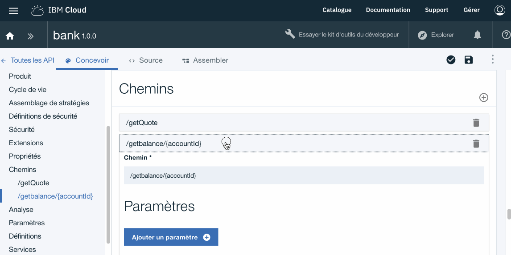
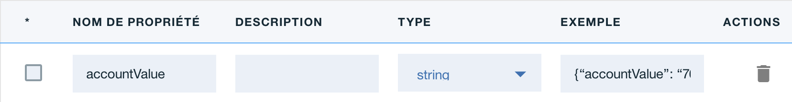
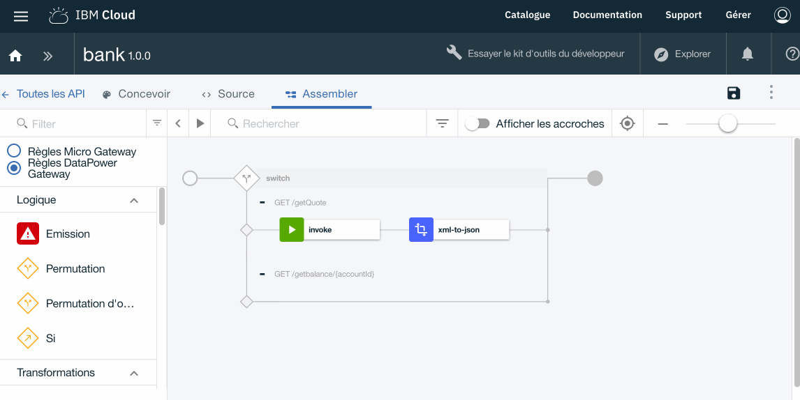
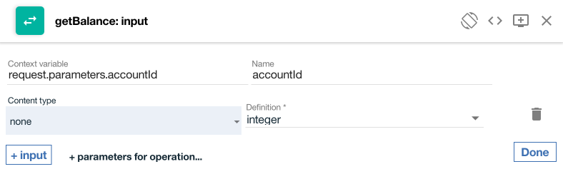
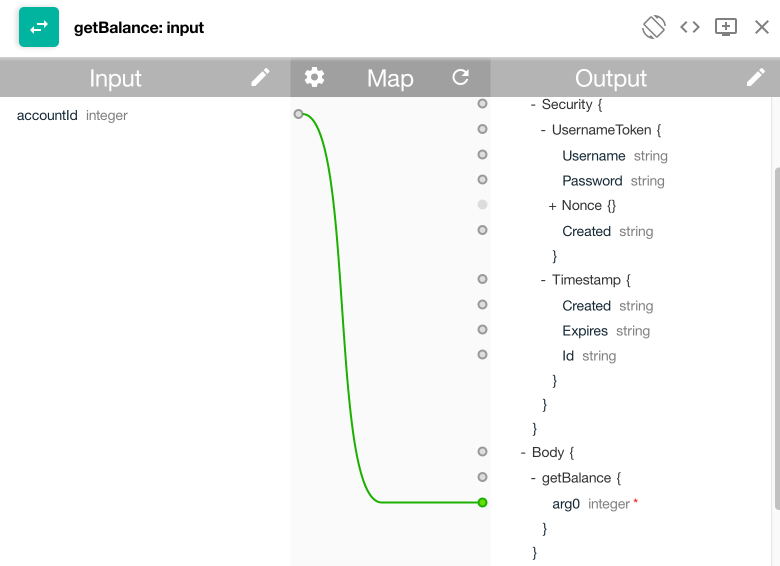

# Proof of Technology API Connect

## Lab 3 : Routing et Service SOAP 

## Cas d'usage 

La banque A dispose d'un ensemble de services SOAP existants qu'elle souhaite exposer via des API afin de favoriser la croissance du marché des appareils mobiles et des appareils. L'équipe commerciale de Bank A sait qu'une meilleure présence des applications mobiles et périphériques améliorera leur image de marque et augmentera la satisfaction des clients.

L'équipe commerciale de Bank A a reçu les exigences de ses développeurs d'applications mobiles pour exposer ses services Web existants en tant qu'API JSON REST. Les charges utiles JSON sont plus petites que les mêmes données au format SOAP, ce qui réduit la quantité de bande passante requise pour les applications mobiles. JSON est aussi une donnée plus facile
format pour travailler avec JavaScript - un langage de programmation populaire pour le développement mobile.

Après avoir envisagé de créer sa propre solution de gestion d'API, l'équipe technologique de Bank A a plutôt décidé de mettre en œuvre une solution IBM API Management, qui lui permettra d'entrer rapidement sur le marché à un coût réduit.

Dans cet exercice, nous allons modifier l'API **bank 1.0.0** afin d'y ajouter une opération qui solicite un service Web existant. 


## Ajout d'un service Web
---

> L'objet de l'opération fournie pas le service web est de retourner le solde d'un compte client. Le compte client (accountId) est placé dans le chemin de la requête.


- Cliquer sur ->  **Brouillon** *(Draft)* > **API** *(API)* >  **bank 1.0.0**

Une fois dans l'onglet **Concevoir** *(Design)*

- Ajouter un **Chemin** *(Path)* nommé **/getBalance/{accountId}**


Libéllé       | Valeur
------------- | -------------
Chemin        | /getbalance/{accountId}



- Ajouter le **Paramêtre** *(Parameter)* nommé **accountId**

> Rappelez vous que dans la description de l'API le paramêtre "accountId" doit contenir l'identifiant du compte transmit au service Web.

Cliquer ->  **Concevoir** *(Design)* > **Chemins** *(Path)* > **/getBalance/{accountId}** > **Ajouter un Paramêtre** 

- Compléter avec les valeurs suivantes :

Libéllé       | Valeur
------------- | -------------
Nom			    | accountId
Situé dans    | Chemin *(Path)*
Requis        | Coché
Type          | interger-32



> Nouveau allons ensuite définir le schéma de sortie relatif à cette API en créant une nouvelle définition.

- Cliquer ->  **Concevoir** *(Design)* > **Definitions** *(Definition)* > `+` 

- Compléter avec les valeurs suivantes :

Libéllé       | Valeur
------------- | -------------
Nom			    | **jsonResponse**
Type 		    | Object
Propriété     | 
Nom           | accountValue
Type          | String
Exemple       | {“accountValue”: “76628730”}



> Nous allons maintenant créer un nouveau service basé sur le service Web

- Cliquer ->  **Concevoir** *(Design)* > **Services** *(Services)* > **+** 

- Choisir **Charger a partir d'une URL**
- Indiquer l'url suivante : **http://banka.mybluemix.net/services/AccountService?wsdl**
- Selectionner l'operation **AccountService** 
- Puis **Terminé**
- **Sauvegarder**


Une fois définit les éléments de l'API requis il reste à finaliser les rêgles d'assemblage.

API Designer comporte une vue d'assemblage que vous pouvez utiliser pour créer des assemblages. 
Cette vue contient une palette qui répertorie les diférentes politiques disponibles (Logique, Transformation, Sécurité etc ...) .

Cliquer ->  **Assembler** *(Assemble)*

Nous avons déjà un assemblage existant définissant le flux associé au chemin **getQuote** (Lab 01).

Pour définir le flux associé au chemin **getBalance**, nous allons utiliser une des politiques de routage d'API Connect.

- Selectionner dans la palette la politique **Permutation**
- Puis faite un Déplacer/Poser de la politique **Permutation** juste devant la politique **invoke**
- Configurer la politique en ajoutant les paramêtres suivants :

Libéllé       | Valeur
------------- | -------------
Cas 0			 | /getQuote
Cas 1 		    | /getBalance/{accountId}


- Deplacer ensuite les composants **invoke** et **XML en JSON** dans le flux relatif à la condition /getQuote


- Selectionner dans la palette la politique **getBalance** (Tout en bas de la liste)
- Puis faite un Déplacer/Poser de la politique **getBalance** dans le flux relatif à la condition **GET /getBalance/{accountId}**



> Nous allons maintenant editer les propriétés d'entrée et de sortie du flux **/getBalance**

- Cliquer sur la politique **getBalance: input**
- Cliquer sur l'icone en forme de crayon pour éditer les paramêtre d'entrée **getBalance: input**


- Cliquer sur le bouton `paramètre pour l'opération` puis selectionner `get /getBalance/{accountId}` puis le bouton **Terminé**
- Nous avons les valeurs suivantes :

```
request.paramter.accountId				accountId 
none 							                integer
```


> Nous allons ensuite associé les valeurs de la requête avec les champs d'entrée requis par le service web.

- cliquer sur le 'rond' en face d'**accountId** puis sur le 'rond' **arg0** (Coté Output)

```	
map property : accountId  with ----> arg0
```


> Nous allons maintenant associé les valeurs de sortie du service web avec les champs de sortie de la requête.


- Cliquer sur la politique **getBalance: ouput**
- Cliquer sur l'icone en forme de crayon pour éditer les paramêtre de sortie **Ouput**


- Cliquer sur le bouton `sortie pour l'opération` puis selectionner `get /getBalance/{accountId}` 

- Puis compléter avec le valeur suivantes :

```
message.body					ouput

application/json    			def/jsonResponse
```
- cliquer sur **Terminé**


- cliquer sur le 'rond' en face du champs **return** (Coté Input) puis sur le 'rond' **accountValue** (Coté Output)

```	
map property : return  with ----> accountValue
```


- **Sauvegarder** en cliquant sur l'icone en haut a droite 


L'intégration du service Web est maintenant terminé.

## Tester votre nouvel API : **bank 1.0.0**
---

- Cliquer sur l'icon **Test** pour ouvrir le panneau des outils de test.

 

- Selectionner le catalogue **Sandbox** (Selectionné par défaut)
- Selectionner le produit **bankproduct 1.0.0** 
- Cliquer sur **Ajouter l'API** *(Add API)*
- Puis **Suivant** *(Next)*

 

- Cliquer sur **Republier le produit** 
- Selectionner l'opération **get /getBalance** 
- Mettre une valeur numérique pour le paramêtre **accountId**
- Puis cliquer sur le bouton **Appeler**

Le résultat devrait avoir le forme suivante :

>Le resultat doit être égale à la valeur du paramêtre *accountId* +1

```
Code de statut:
200 OK

Temps de réponse:
2512ms

En-têtes:
content-type: application/json
x-global-transaction-id: 43573929
apim-debug-trans-id: 10.138.25.7-e62f52d5-4a05-43ce-9021-22df7890d3f8

Corps du message:

{
  "accountValue": "13"
}
```
 


## Résumé
---

Durant cet exercice, nous avons montrer les points suivants :

- Utilisation de facultés de routage d'API Connect 
- Comment intégrer un web service (SOAP) existant
- Utiliser les composants de mapping de la solution API Connect
- Tester une API


## Continuer

Aller à - [Lab 4 - Securiser une API avec OAuth 2.0](/potfr/labs/lab04.md)


---
##### 2018 - frederic_dutheil@fr.ibm.com