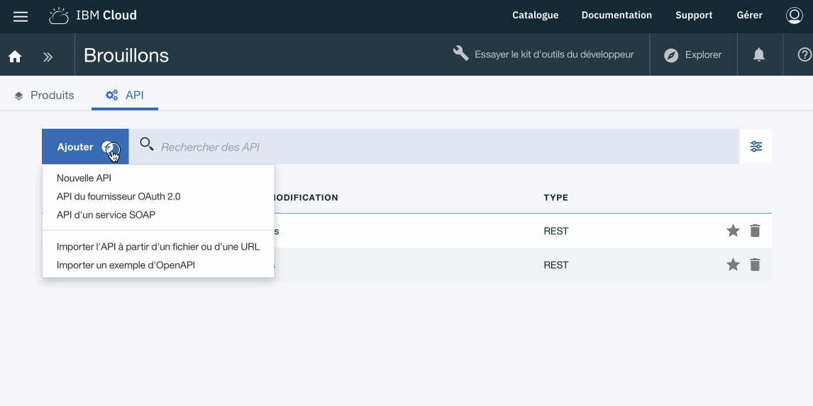
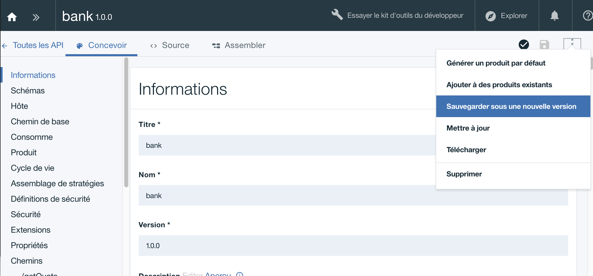
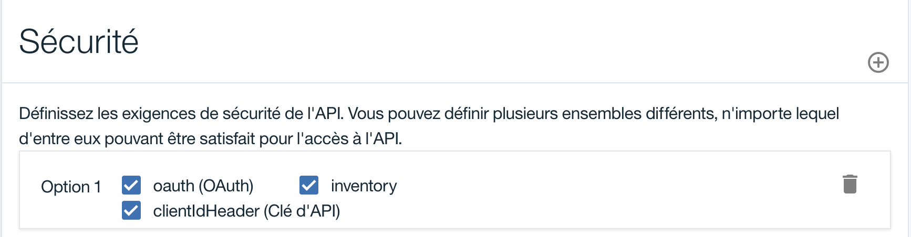
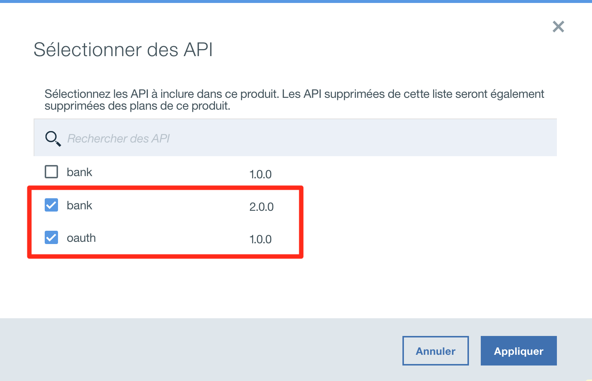
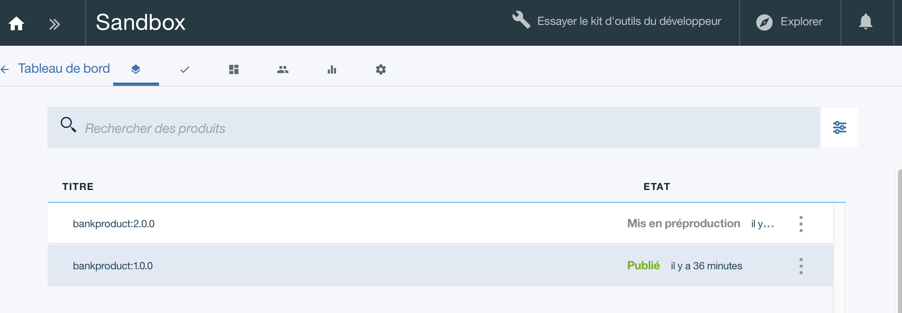
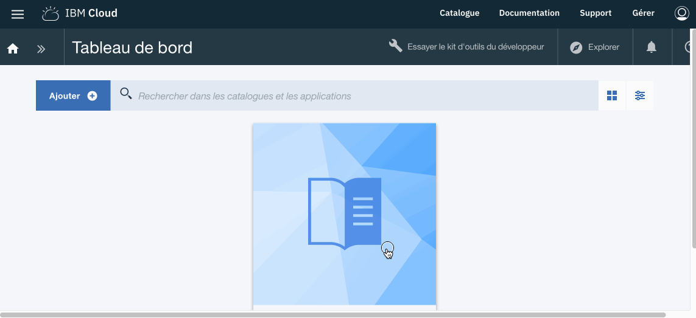
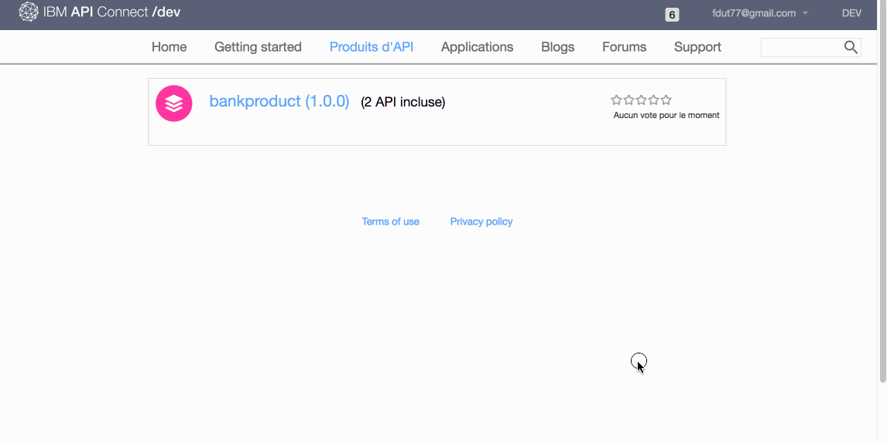

# Proof of Technology API Connect

## Lab 4 : Securiser une API avec OAuth 2.0 

## Objectif 

Dans cet exercice, nous allons sécuriser l'API **bank 1.0.0** pour protéger les ressources exposés par Bank A. Les consommateurs des APIs devront obtenir un token OAuth valide avant de pouvoir invoquer l'API **bank**

Nous allons donc voir les points suivants:

+ Comment créer un fournisseur OAuth 2.0
+ Comment cloner une API pour en générer une nouvelle version.
+ Sécuriser une API via un fournisseur OAuth 2.0 

> Nous allons commencer par créer une API OAuth 2.0 
>

## Créer un fournisseur OAuth 2.0
---

API Connect permet de dissocier la politique de sécurité du contexte fonctionnel. Aussi une equipe de développeur peut développer les APIs de sécurité et une autres les APIs fonctionnelle.

Cliquer sur -> **Brouillon** *(Draft)* > **API** *(API)* > **Ajouter** *(Add)* > **API du fournisseur OAuth 2.0** 

Compléter avec les valeurs suivantes et cliquer sur **Creer**

Libéllé       | Valeur
------------- | -------------
Titre         | oauth
Nom			    | oauth
Chemin de base       | /
Version       | 1.0.0

||| IMPORTANT : Vérifier que la valeur du chemin de base est bien /

Une fois dans l'onglet **Concevoir** *(Design)*

- Sur le panneau de gauche selectionner la rubrique **OAuth 2**
- Compléter les champs suivants :

Libéllé | Valeur
--------|-------
Type de client | Confidentiel

- Portée : Modifier la portée nommée **scope 1**

Libéllé | Valeur
--------|-------
Nom | inventory
Description | Accés au API Bank A

Supprimer les Portées **scope2** et **scope3**

Nous voulons configurer ce provider pour supporter seulement les accords de type **Mot de passe** 

- Décocher les accords : Implicite, Application et Code d'accès

 

In the Identity extraction section, set the Collect credentials using drop-down menu to Basic.
- Dans la section **Extraction d'identité**

Libéllé | Valeur
--------|-------
Collecter les données d'identification avec | **De base**

- Dans la section **Authentification**,  modifier les champs suivants :

Libéllé | Valeur
--------|-------
Authentifier les utilisateurs de l'application avec | **URL d'authentification**
URL d'authentification | **https://thinkibm-services.mybluemix.net/auth**

- **Sauvegarder** en cliquant sur l'icone en haut a droite 

La conception en l'API OAuth 2 est maintenant terminé.

## Créer une nouvelle version de l'API **bank 1.0.0**
---

- Cliquer sur ->  **Brouillon** *(Draft)* > **API** *(API)* >  **bank 1.0.0**
- Dans le coin a droite de l'écran, cliquer sur l'icone

- Selectionner l'option : **Sauvegarder sous une nouvelle version**

- Entrer un nouveau numéro de version comme **2.0.0** et cliquer sur **Sauvegarder sous une nouvelle version**

> Nous avons maintenant 2 versions disponibles pour une même API.
> La version **bank 1.0.0** sera l'API non sécurisé par OAuth 2.0 et la version **bank 2.0.0** sera l'API sécurisé via OAuth 2.0
> 

## Appliquer la politique de sécurité OAuth 2.0 pour l'API **bank 2.0.0**

- Cliquer ->  **Brouillon** *(Draft)* > **API** *(API)* >  **bank 2.0.0**

- Dans la section **Définition de sécurité**, cliquer sur le **+** afin d'ajouter une nouvelle définition **OAuth**

Libéllé | Valeur
--------|-------
Nom | **oauth**
Description | **Resource Owner Password Grant Type**
Flux | **Mot de passe**
URL de jeton | **{Catalog Gateway Endpoint}/oauth2/token**

L'URL du jeton sera basée sur l'emplacement de votre organisation et de votre espace sur IBM Cloud  public.

Vous pouvez trouver votre URL Gateway Endpoint via le menu `>>` puis **Tableau de bord** -> **Sandbox** -> **Paramêtres** -> **Passerelle** 

 Localisez ENDPOINT, copiez simplement et collez le contenu dans le champ URL de jeton de vos paramètres API OAuth, puis ajoutez /oauth2/token jeton.

- Ajouter une Portée avec les valeurs suivantes :

Libéllé | Valeur
--------|-------
Nom de la portée | **inventory**
Description | **Acces aux ressources de Bank A**

- Dans la section **Sécurité** coché pour l'option 1 :  **oauth** et **inventory**.

- **Sauvegarder** en cliquant sur l'icone en haut a droite 

L'API **bank 2.0.0** est maintenant sécurité avec OAuth 2.0

## Créer une nouvelle version du produit d'API **bankproduct 2.0.0**
---

- Cliquer ->  **Brouillon** *(Draft)* > **Produit** *(Product)* >  **bankproduct 1.0.0**

- Dans le coin a droite de l'écran, cliquer sur l'icone

- Selectionner l'option : **Sauvegarder sous une nouvelle version**

- Entrer un nouveau numéro de version comme **2.0.0** et cliquer sur **Sauvegarder sous une nouvelle version**

### Mise à jour du produit d'API **bankproduct 2.0.0**

- Dans la section **API** 
- Supprimer **bank 1.0.0** 
- cliquer sur le **+** et ajouter **bank 2.0.0**, **oauth 1.0.0**
 

- **Sauvegarder** en cliquant sur l'icone en haut a droite 
- Puis **Publier**

Nous avons maintenant 2 produits d'API déployés, la version bankproduct 1.0.0 `publier` et bankproduct 2.0.0 en `mise en pré-production`

Menu `>>` puis **Tableau de bord** -> **Sandbox**

Nous allons remplacer la version 1.0.0 par la version 2.0.0

Pour le produit **bankproduct 2.0.0** 

- cliquer sur l'icone 

- Puis selectionner **Remplacer un produit existant**
- Selectionner **bankproduct 1.0.0** puis **Suivant**
- Selectionner les plans à **Remplacer**
- Cliquer sur le bouton **Remplacer

A la fin de l'opération le produit **bankproduct 2.0.0** est `Publier` et le produit **bankproduct 1.0.0** est `Retiré`

Nous pouvons alors tester les APIs dans le Portail Developpeur.

- Cliquer sur **Produit d'API**
- Puis **bankproduct 2.0.0**

Il n'est pas nécéssaire de souscrire de nouveau car les souscription ont été migré automatiquement.

- Cliquer dans le panneau a droite sur l'API **bank**
- Puis sur l'action **GET /getQuote**
- Sur le panneau de gauche, des exemples d'appel de l'API avec différents type de langage sont disponible.
- Aller dans la section **Exemple de demande**
- l' **id Client** a été renseigné par defaut.
- Il est nécéssaire de renseigner le **Client Secret** *(Valeur confidentielle du client)* pour obtenir un jeton valide
- Renseigner les champs **Utilisateur** et **Mot de passe** (user/user)
- Cliquer sur le bouton **Autoriser**

>En cas de succès un jeton est retourné et sera utiliser pour appeler l'action GET /getQuote

- Renseigner le paramêtre symbol avec la valeur **IBM** et cliquer sur le bouton **Appeler une Opération**

## Résumé
---

Durant cet exercice, nous avons montrer les points suivants :
 
- Création d'une nouvelle version d'une API et d'un produit existants
- Creation d'une API OAuth 2.0
- Securisation d'une API via OAuth 2.0

## Continuer

Aller à - [Lab 5 - Analytique](/potfr/labs/lab05.md)

---
##### 2018 - Frederic Dutheil