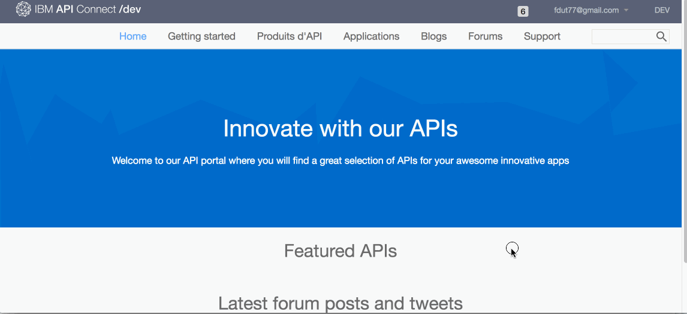

# Proof of Technology API Connect

## Lab 4 : Analytique 

## Objectif 

Dans cet exercice, nous allons découvrir les capacités d'Analyse aussi bien pour le Fournisseur d'API (Provider) que le Consommateur d'API (Consumer).

Vous comprendrez mieux comment les analyses sont utilisées pour visualiser les informations capturées par l'API Gateway. Vous pouvez filtrer, trier et agréger vos données d'événement API; Ensuite, présentez les résultats dans des tableaux, tableaux et cartes corrélés pour vous aider à gérer les niveaux de service, définir des quotas, établir des contrôles, définir des politiques de sécurité, gérer les communautés et analyser les tendances. 

API Analytics repose sur la plate-forme d'analyse et de visualisation open source Kibana, conçue pour fonctionner avec le moteur de recherche et d'analyse distribué en temps réel d'Elastic Search.

## Analytique : API Manager

L'analytique côté API Manager fournie les informations d'analyse pour le Fournisseur d'API.

- Cliquer sur l'icone **>>** -> **Tableau de bord** *(Dashboard)* > **Sandbox**

- De l'ecran de configuration du catalogue **Sandbox**, cliquer sur l'onglet **Analyse**

    

- Le tableau de bord par défaut donne des informations générales telles que les cinq produits les plus actifs et les cinq API les plus actives. Cette information est intéressante, mais nous pouvons voir d'autres tableaux de bord qui fournissent plus de données.

- Cliquez sur l'icône `Load Saved Dashboards` pour ouvrir la liste des tableaux de bord. Sélectionnez le tableau de bord `api-default`.

    

- Vous verrez ici des visualisations intéressantes montrant des graphiques et des graphiques contenant des informations sur le trafic API traité.

- Les données analytiques peuvent être filtrées sur différentes périodes et les zones de visualisation peuvent même être automatiquement actualisées. Cliquez sur l'icône du calendrier qui spécifie la période par défaut de `Last 7 days`.

    

- Définisser **Time Range** à `Aujourd'hui`.
	
- Cliquez sur `Auto Refresh` et réglez la période de rafraîchissement à` 5 secondes`.

    

- Revenez à l'application client dans le navigateur Web Chrome. Naviguer sur le site et tester certaines fonctionnalités pour générer des appels API supplémentaires.

- Revenez à la vue analytique et notez comment les données sont actualisées automatiquement.

## Analytique : Portail Developpeur

L'analytique côté Portail Developpeur fournie les informations d'analyses pour le Fournisseur d'API.

- Se connecter au Portail Developpeur. 

>Pour connaitre l'url du Portail Developpeur : Cliquer sur l'icone **>>** > **Tableau de bord** *(Dashboard)* > **Sandbox** > **Paramêtres** *(Settings)*> **Portail** 

- Cliquer sur Application puis sur l'application **mobileapp** (ou un autre application de votre choix) puis cliquer sur l'icone **Analyse**

- Le consomateur a ici en temps réel sa consommation des APIs avec le taux de succès, usage de données, la latence.

Il est bien sur possible de changer la période de temps pour avoir des informations horaires, journalière, mensuelles, annuelles.

## Résumé

Durant cet exercice, nous avons montrer les points suivants :
 
- Analytique pour Fournisseur d'API via l'API Manager
- Analytique pour Consommateur d'API via le Portail Developpeur

---

2018 - frederic_dutheil@fr.ibm.com