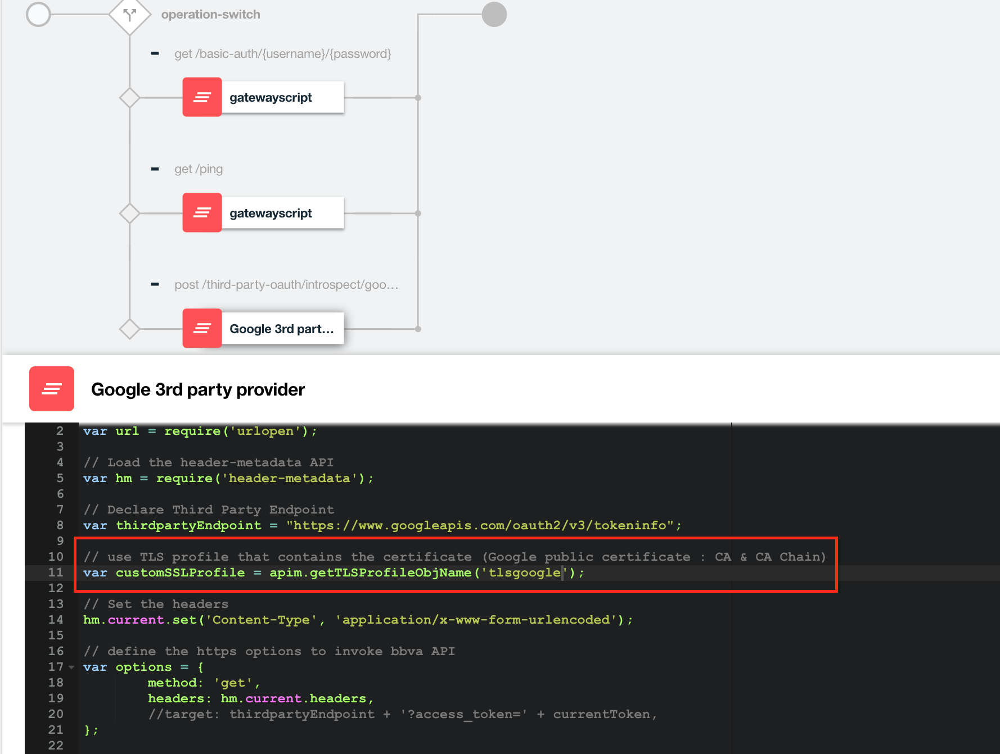
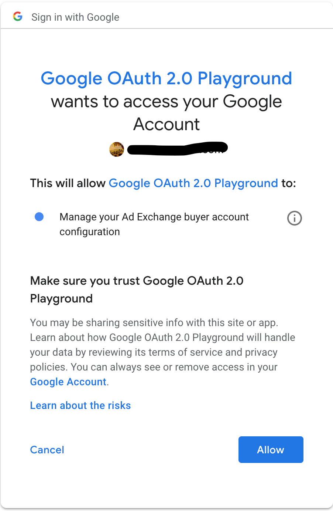

# Integrate third party OAuth provider (Google) to secure APIs


This tutorial is a sample how to secure an API with an access token from Google, when Google is the OAuth provider and API Connect is your API Management solution.

The API Connect API Security definition uses the Appid for its identity and the OAuth Token Introspection support. Google does not support the OAuth Token introspection support (RFC 7662) standard, so you will employ a workaround using API Connect gatewayscript policy to make things work properly. 

This tutorial use API Connect Public Cloud instance but it works fine on other platform.


## Prepare your APIs

API Connect ships with a built-in OAuth provider that provides complete OAuth authorization server capabilities, such as grant validation, identity extraction, authentication, authorization, token management, introspection, and more.

The OAuth provider in API connect is able to generate and validate access tokens to secure backend resources. More specifically, when API Connect generates the OAuth token, it knows exactly how to validate it.

If your using a non-API Connect OAuth authorization server to generate OAuth tokens (such as Google), then API Connect can still validate those token but you will need to tell it how to validate non-API connect generated tokens.

Even if the third-party oauth provider does not support the standard introspection lookup (RFC 7622 not supported Google) but supports an alternative approach to token validation, you can proxy to a "microservice" that can perform the token validation based on a supported interface.

In this scenario, API Connect is able to validate the token but performs no token management capabilities (generate, revoke, refresh), you will need to use the third-party OAuth server directly for these operations.

The typical developer flow for this type of scenario is the following:

- Application developer creates an application in the developer portal and obtains a client id and client secret.

- (Optional) During the creation of the client id and secret from (1), the Third-party OAuth server will also need the same client id and secret as part of its OAuth server configuration. The dev portal will need to push the same information to the OAuth third-party server. This requirement is outside the scope of this tutorial. For more information, see [here](https://www.ibm.com/support/knowledgecenter/SSMNED_5.0.0/com.ibm.apic.devportal.doc/tutorial_syncing_application_credentials.html)

- After the App developer creates an application, it wil make a note of the published OAuth endpoint in the dev portal, which should point directly to the third-party OAuth provider. The API enforcement point will still be API Connect. This is the key point, API Connect does not participate in the OAuth authentication flow, it will ONLY perform token validation to protect access to the API resource.

Example: 
		
* OAuth endpoints: `https://<third-party-oauth-provider>/oauth2/token` & `https://<third-party-oauth-provider>/oauth2/authorize`

* API Resource endpoint: `https://<api-connect-endpoint>/weather/current`

- The App developer application will obtain an access token from the third-party OAuth endpoint. It will then call the API Resource endpoint (in API Connect).

- API Connect OAuth provider will extract the token from the message and perform an OAuth introspection lookup against the third-party OAuth provider (via a "microservice" of in our case) to validate the OAuth token. 

If successful, it will then execute the Assembly policies, where it will proxy the request to the backend API resource.

The following diagram summarizes the scenario:


### Create/Update a TLS profile for communication with Google endpoint

For secure connection with Google Endpoint we need to import public certificates of Google endpoint in a TLS profile and use it in the gatewayscript policy ("microservice)

- Use the following command to show public certificate of Google endpoint :

```openssl s_client -connect www.googleapis.com:443 -showcerts```

```
Certificate chain
 0 s:/C=US/ST=California/L=Mountain View/O=Google LLC/CN=*.googleapis.com
   i:/C=US/O=Google Trust Services/CN=Google Internet Authority G3
-----BEGIN CERTIFICATE-----
MIIE3zCCA8egAwIBAgIIHdIICJKWEs0wDQYJKoZIhvcNAQELBQAwVDELMAkGA1UE
BhMCVVMxHjAcBgNVBAoTFUdvb2dsZSBUcnVzdCBTZXJ2aWNlczElMCMGA1UEAxMc
R29vZ2xlIEludGVybmV0IEF1dGhvcml0eSBHMzAeFw0xODEwMjMxNjUzMDBaFw0x
OTAxMTUxNjUzMDBaMGoxCzAJBgNVBAYTAlVTMRMwEQYDVQQIDApDYWxpZm9ybmlh
MRYwFAYDVQQHDA1Nb3VudGFpbiBWaWV3MRMwEQYDVQQKDApHb29nbGUgTExDMRkw
FwYDVQQDDBAqLmdvb2dsZWFwaXMuY29tMIIBIjANBgkqhkiG9w0BAQEFAAOCAQ8A
MIIBCgKCAQEA6HD2AtJnwrhuvvRN5hZlOjoXMQ5ssvsZLxlLxHp8gKRy4ZEr4gFF
Ct+3sTlukXKiqv5QyhYTNNpRzgBOm1Mmv9d9PDsc62sG8Fan031q7Ee8CCHyHcWm
jf+TrEPDw0/GABrdKK6CrR4D435tYUg0pxXOzgVgbBmR9+Y8zANvbWIbBDMolzzN
XU0/vOow4YOBFnbEKFFD3beqiA5b8HTKF4r0U5lRJb0wQnnBbefE4Wd4naT/NzRj
bHNGAhKgMF7HY6m/0JwmYX4Av5W05qHk3RY4rNP4blOjeg73u/WkqyKa7IMOZhNr
yo47SENk30zTKlVa2vitf1DWhBXqDYXgXQIDAQABo4IBnTCCAZkwEwYDVR0lBAww
CgYIKwYBBQUHAwEwdAYDVR0RBG0wa4IQKi5nb29nbGVhcGlzLmNvbYIVKi5jbGll
bnRzNi5nb29nbGUuY29tghgqLmNsb3VkZW5kcG9pbnRzYXBpcy5jb22CFmNsb3Vk
ZW5kcG9pbnRzYXBpcy5jb22CDmdvb2dsZWFwaXMuY29tMGgGCCsGAQUFBwEBBFww
WjAtBggrBgEFBQcwAoYhaHR0cDovL3BraS5nb29nL2dzcjIvR1RTR0lBRzMuY3J0
MCkGCCsGAQUFBzABhh1odHRwOi8vb2NzcC5wa2kuZ29vZy9HVFNHSUFHMzAdBgNV
HQ4EFgQUaLeXiTFVAnDh2lPawocwOBuQenEwDAYDVR0TAQH/BAIwADAfBgNVHSME
GDAWgBR3wrhQmmd2drEtwobQg6B+pn66SzAhBgNVHSAEGjAYMAwGCisGAQQB1nkC
BQMwCAYGZ4EMAQICMDEGA1UdHwQqMCgwJqAkoCKGIGh0dHA6Ly9jcmwucGtpLmdv
b2cvR1RTR0lBRzMuY3JsMA0GCSqGSIb3DQEBCwUAA4IBAQDJwTHu96b/S2bb00/s
sZwoUUHAeE1OgcPJpG+1e7jXAu4wMbwoX+aEPGpmt1XeLNzexI+Ilq2VTviJnn0Y
sGB4mnORfST0K2RbPkKF6Nw/wLWaopnXjBl2TEj4ICe+/F8en1ldRlB1DT/suM7R
IalIKMf0N26qKpJznY7eNTOKFf93jfKHYdhKkocoBHaYTOSZX4YgozkR+VqxFqGz
52oHQtdHd7LVzHfADH93uRFRKcYdDl5IDaKEV86xD5D2rz205q/UKQ9uTRT2a44H
I50RcQbmV7SW1toWE5gysMQM8r129Vh7kyORbxXcO2fLoxP2e2mRa+t35/nMXqLx
oP9h
-----END CERTIFICATE-----
 1 s:/C=US/O=Google Trust Services/CN=Google Internet Authority G3
   i:/OU=GlobalSign Root CA - R2/O=GlobalSign/CN=GlobalSign
-----BEGIN CERTIFICATE-----
MIIEXDCCA0SgAwIBAgINAeOpMBz8cgY4P5pTHTANBgkqhkiG9w0BAQsFADBMMSAw
HgYDVQQLExdHbG9iYWxTaWduIFJvb3QgQ0EgLSBSMjETMBEGA1UEChMKR2xvYmFs
U2lnbjETMBEGA1UEAxMKR2xvYmFsU2lnbjAeFw0xNzA2MTUwMDAwNDJaFw0yMTEy
MTUwMDAwNDJaMFQxCzAJBgNVBAYTAlVTMR4wHAYDVQQKExVHb29nbGUgVHJ1c3Qg
U2VydmljZXMxJTAjBgNVBAMTHEdvb2dsZSBJbnRlcm5ldCBBdXRob3JpdHkgRzMw
ggEiMA0GCSqGSIb3DQEBAQUAA4IBDwAwggEKAoIBAQDKUkvqHv/OJGuo2nIYaNVW
XQ5IWi01CXZaz6TIHLGp/lOJ+600/4hbn7vn6AAB3DVzdQOts7G5pH0rJnnOFUAK
71G4nzKMfHCGUksW/mona+Y2emJQ2N+aicwJKetPKRSIgAuPOB6Aahh8Hb2XO3h9
RUk2T0HNouB2VzxoMXlkyW7XUR5mw6JkLHnA52XDVoRTWkNty5oCINLvGmnRsJ1z
ouAqYGVQMc/7sy+/EYhALrVJEA8KbtyX+r8snwU5C1hUrwaW6MWOARa8qBpNQcWT
kaIeoYvy/sGIJEmjR0vFEwHdp1cSaWIr6/4g72n7OqXwfinu7ZYW97EfoOSQJeAz
AgMBAAGjggEzMIIBLzAOBgNVHQ8BAf8EBAMCAYYwHQYDVR0lBBYwFAYIKwYBBQUH
AwEGCCsGAQUFBwMCMBIGA1UdEwEB/wQIMAYBAf8CAQAwHQYDVR0OBBYEFHfCuFCa
Z3Z2sS3ChtCDoH6mfrpLMB8GA1UdIwQYMBaAFJviB1dnHB7AagbeWbSaLd/cGYYu
MDUGCCsGAQUFBwEBBCkwJzAlBggrBgEFBQcwAYYZaHR0cDovL29jc3AucGtpLmdv
b2cvZ3NyMjAyBgNVHR8EKzApMCegJaAjhiFodHRwOi8vY3JsLnBraS5nb29nL2dz
cjIvZ3NyMi5jcmwwPwYDVR0gBDgwNjA0BgZngQwBAgIwKjAoBggrBgEFBQcCARYc
aHR0cHM6Ly9wa2kuZ29vZy9yZXBvc2l0b3J5LzANBgkqhkiG9w0BAQsFAAOCAQEA
HLeJluRT7bvs26gyAZ8so81trUISd7O45skDUmAge1cnxhG1P2cNmSxbWsoiCt2e
ux9LSD+PAj2LIYRFHW31/6xoic1k4tbWXkDCjir37xTTNqRAMPUyFRWSdvt+nlPq
wnb8Oa2I/maSJukcxDjNSfpDh/Bd1lZNgdd/8cLdsE3+wypufJ9uXO1iQpnh9zbu
FIwsIONGl1p3A8CgxkqI/UAih3JaGOqcpcdaCIzkBaR9uYQ1X4k2Vg5APRLouzVy
7a8IVk6wuy6pm+T7HT4LY8ibS5FEZlfAFLSW8NwsVz9SBK2Vqn1N0PIMn5xA6NZV
c7o835DLAFshEWfC7TIe3g==
-----END CERTIFICATE-----

```


- Copy & Paste the certificates 0 & 1 in two text files and import these files in a TLS profile  


This TLS profile will be used in the Gatewayscript (API Connect Policy) for communication with Google Endpoint.

### Import API Utility & Weather provider api

- Import API definitions file: utility and Weather. In API panel in Draft page, click the Add (+) button and select Import API from a file or URL.

https://raw.githubusercontent.com/fdut/apic/master/security/Google3rdPartyProvider/api/weather-provider-api_1.0.1.yaml

https://raw.githubusercontent.com/fdut/apic/master/security/Google3rdPartyProvider/api/utility_1.0.1.yaml

### Understand Utility api

Navigate to the link:  https://github.com/fdut/apic/tree/master/security/Google3rdPartyProvider directory and open the introspect-google.js file.

This file is the content of the microservice used to validate token by the Google Third Party provider (https://www.googleapis.com/oauth2/v3/tokeninfo)

API Connect defines an interface with the third-party introspection that requires an http response code of 200 and a JSON element named active with the value true.

In the code, the key part is var response = { "active": true }; and apim.setvariable('message.status.code', 200);. 


Read the code to understand the input to the request and the expected response.


- Open the API designer and select the utility API. This API containt the microservice to validate the token. For that we use a gatewayscript policy for google third-party introspection lookup (it uses the introspect-google.js code).

- Click the Assemble tab and select the switch statement with the condition /third-party-oauth/introspect/google-microservice and its corresponding GatewayScript. Its the same code you just examined. 

**Review the code and check the name of TLS profile is the same you are created previously**




### Protect API with Introspection lookup

Now we are going to secure access our ressource API (Weather provider API) with Google OAuth token.

- Open the Weather Provider API and scroll down to Security Definitions. Click the + button and select OAuth.

- Enter the name **Google-oauth-third-party**

- In the Introspection URL field, enter the url to access to your utility API: 

	```https://<hostname>/<org>/<catalog>/utility/third-party-oauth/introspect/google-microservice```

	For example
		
	```https://192.168.225.53/internalorg/sb/utility/third-party-oauth/introspect/google-microservice```. 

	Leave the remaining fields at their default values.

	

- In the Security section, create a new security requirement (click +) and select ClientId (API Key) and Google-oauth-third-party (OAuth). Click the up array to move it as Option 1.

	

- Click Save.

### Publish your product

- Create a Product

- Add to this product the Utility & Weather provider API

- Publish the product

## Test your API

- Obtain an access token from the Google Third-Party OAuth provider (using the Google OAuth 2.0 Playground) .

	OAuth 2.0 Playground is available here : [OAuth 2.0 Playground](https://developers.google.com/oauthplayground/)

	Use the OAuth 2.0 Playground to obtain an access token by expanding the **Ad Exchange Buyer API II v2beta1** entry in the list and clicking the URL. Then click the **Authorize APIs** button.

	

- Click your Gmail account and click the **Allow** button.

   
	
- Click **Exchange authorization code for tokens** button and note that the access token expires in 3600 seconds (1 hour).
		
	
	
- Copy the access token to a note pad for later use.

- Test the API using using Postman

	If not already done, install [Postman](https://www.getpostman.com/)  and then import the collection request file by clicking Import and selecting file available here : 
		
	``https://raw.githubusercontent.com/fdut/apic/master/security/Google3rdPartyProvider/GoogleAuth.postman_collection.json``
		
- Open the Weather request and select the Headers tab. 
	
- Replace value ``{{client_id}}`` with client id provider by API Connect and ``{{access_code}}`` with token provided by google.

- Click Send to validate that the request is successful.

	```
	{
		"zip": "90210",
		"temperature": 66,
		"humidity": 78,
		"city": "Beverly Hills",
		"state": "California",
		"platform": "Powered by IBM API Connect"
	}
	```

- In case of wrong access_code you are the 

	```
	{
    "httpCode": "401",
    "httpMessage": "Unauthorized",
    "moreInformation": "Token is invalid"
	}
	```
	
**Congratulations! You secured an API with an access token from Google as the OAuth provider.**


# Other ressources


[Integrate third party OAuth provider (Google) to secure APIs](https://developer.ibm.com/apiconnect/2017/10/10/integrate-third-party-oauth-provider-google/)

[OAuth 2.0 Playground](https://developers.google.com/oauthplayground/)

[Using third party OAuth providers to secure APIs](
https://developer.ibm.com/apiconnect/2017/11/10/using-third-party-oauth-providers-secure-apis/)