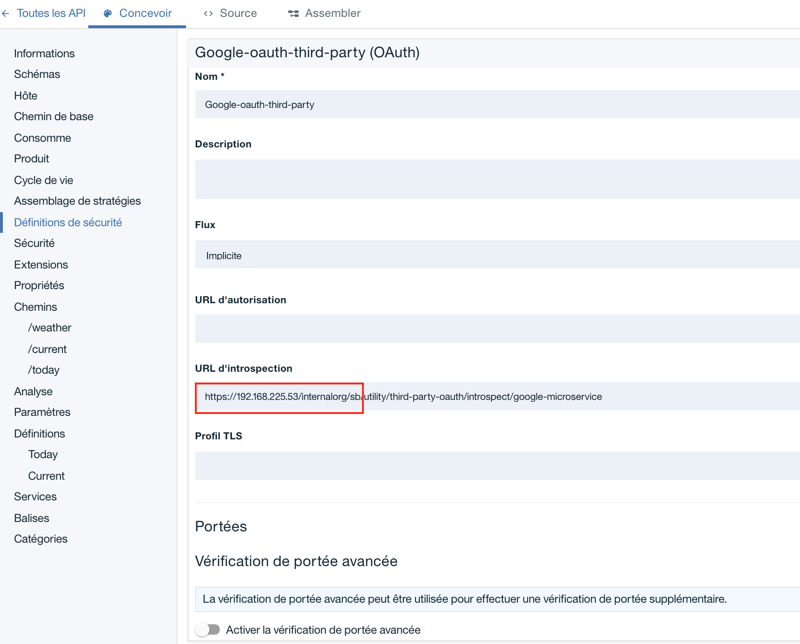
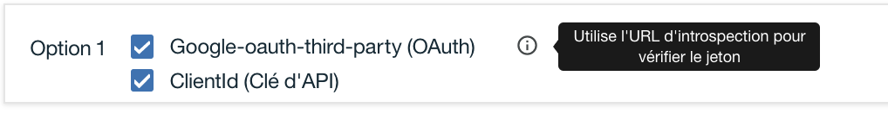
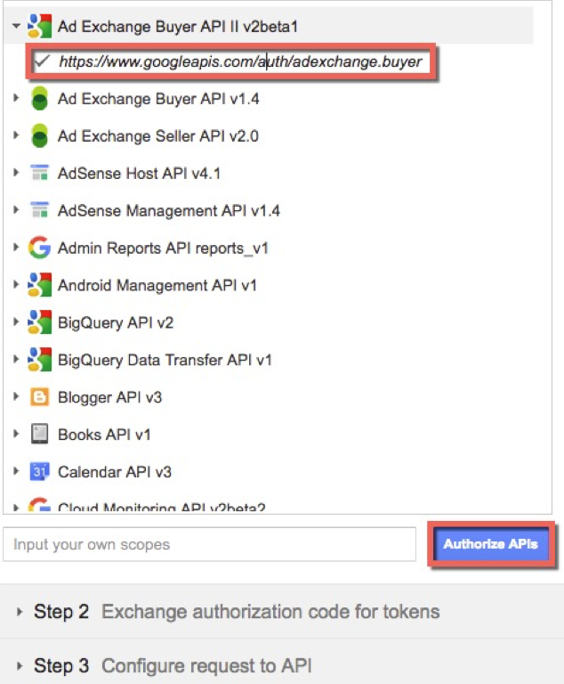
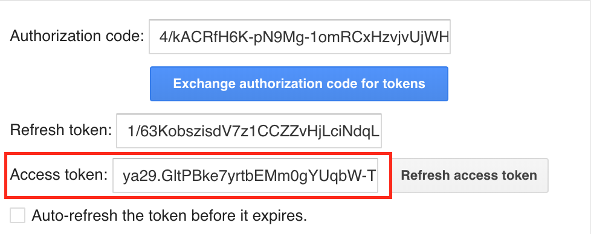

# Integrate third party OAuth provider (Google) to secure APIs


In this tutorial you will learn how to secure an API with an access token from Google, when Google is the OAuth provider. The API Connect API Security definition uses the Appid for its identity and the OAuth Token Introspection support. Google does not support the OAuth Token introspection support (RFC 7662) standard, so you will employ a workaround to make things work properly as follows:

- Connect to your API Connect Public Cloud instance
- Import the utility_1.0.1.yaml and weather-provider-api_1.0.1.yaml API files into your APIC draft space.
- Get an access token using the bridging service from Google – OAuth 2.0 Playground
- Convert the token from Google format to introspection format using a microservice in the utility.yaml API in API Connect
Secure the weather API using the Google OAuth token
- Test using Postman to call the weather API

## Why third-party OAuth in Mobile applications?
Web / Mobile applications that provide access to third-party API services make it easy to share resources. The OAuth provider (in this case Google) store the ‘permission’ granted to the third-party OAuth application so they don’t need to re-ask your permissions again and again. This allows you to login to the Web / Mobile application using your Google credentials without being prompted repeatedly to perform the OAuth handshake to maintain data privacy.

## Instructions:

API Connect ships with a built-in OAuth provider that provides complete OAuth authorization server capabilities, such as grant validation, identity extraction, authentication, authorization, token management, introspection, and more. The OAuth provider in API connect is able to generate and validate access tokens to secure backend resources. More specifically, when API Connect generates the OAuth token, it knows exactly how to validate it.

If your using a non-API Connect OAuth authorization server to generate OAuth tokens (such as Google), then API Connect can still validate those token but you will need to tell it how to validate non-API connect generated tokens.

In this tutorial, you will learn how to configure API Connect to validate a Google third-party access token using the introspection callout feature, based on RFC 7622. 

Even if the third-party oauth provider does not support the standard introspection lookup (Ex: Google) but supports an alternative approach to token validation, you can proxy to a microservice that can perform the token validation based on a supported interface. In this scenario, API Connect performs no token management capabilities (generate, revoke, refresh or introspect access tokens), you will need to use the third-party OAuth server directly for these operations.

- Import API definitions file: utility and Weather. In API panel in Draft page, click the Add (+) button and select Import API from a file or URL.

https://raw.githubusercontent.com/fdut/apic/master/security/Google3rdPartyProvider/api/weather-provider-api_1.0.1.yaml

https://raw.githubusercontent.com/fdut/apic/master/security/Google3rdPartyProvider/api/utility_1.0.1.yaml

The typical developer flow for this type of scenario is the following:

- Application developer creates an application in the developer portal and obtains a client id and client secret.

- (Optional) During the creation of the client id and secret from (1), the Third-party OAuth server will also need the same client id and secret as part of its OAuth server configuration. The dev portal will need to push the same information to the OAuth third-party server. This requirement is outside the scope of this tutorial. For more information, see [here](https://www.ibm.com/support/knowledgecenter/SSMNED_5.0.0/com.ibm.apic.devportal.doc/tutorial_syncing_application_credentials.html)

- After the App developer creates an application, it wil make a note of the published OAuth endpoint in the dev portal, which should point directly to the third-party OAuth provider. The API enforcement point will still be API Connect. This is the key point, API Connect does not participate in the OAuth authentication flow, it will ONLY perform token validation to protect access to the API resource.

**Example**: 
		
* OAuth endpoints: `https://<third-party-oauth-provider>/oauth2/token` & `https://<third-party-oauth-provider>/oauth2/authorize`

* API Resource endpoint: `https://<api-connect-endpoint>/weather/current`

- The App developer application will obtain an access token from the third-party OAuth endpoint. It will then call the API Resource endpoint (in API Connect).

- API Connect OAuth provider will extract the token from the message and perform an OAuth introspection lookup against the third-party OAuth provider (via a "microservice" of in our case) to validate the OAuth token. 

If successful, it will then execute the Assembly policies, where it will proxy the request to the backend API resource.

The following diagram summarizes the scenario:


Navigate to the folder https://github.com/fdut/apic/tree/master/security/Google3rdPartyProvider directory and open the introspect-google.js file.

This file is the content of the microservise used to validate token by the Google Third Party provider (https://www.googleapis.com/oauth2/v3/tokeninfo)

API Connect defines an interface with the third-party introspection that requires an http response code of 200 and a JSON element named active with the value true.

In the code, the key part is var response = { "active": true }; and apim.setvariable('message.status.code', 200);. 

Read the code to understand the input to the request and the expected response.

- Open the API designer and select the utility API. This API containt the microservice to validate the token. For that we use a gatewayscript policy for google third-party introspection lookup (it uses the introspect-google.js code).

- Click the Assemble tab and select the switch statement with the condition /third-party-oauth/introspect/google-microservice and its corresponding GatewayScript. Its the same code you just examined. If you made any changes, you can copy the code from introspect-google.js and paste it here or leave it as-is.

### Protect API with Introspection lookup

Now we are going to secure access to our ressource API (Weather provider API) with Google OAuth token.

- Open the Weather Provider API and scroll down to Security Definitions. Click the + button and select OAuth.

- Enter the name **Google-oauth-third-party**.
- In the Introspection URL field, enter the url to access to your utility API: 

	```https://<hostname>/<org>/<catalog>/utility/third-party-oauth/introspect/google-microservice```

	For example
		
	```https://192.168.225.53/internalorg/sb/utility/third-party-oauth/introspect/google-microservice```. 

	Leave the remaining fields at their default values.

	

- In the Security section, create a new security requirement (click +) and select ClientId (API Key) and Google-oauth-third-party (OAuth). Click the up array to move it as Option 1.

	

- Click Save.

## Test your API

- Obtain an access token from the Google Third-Party OAuth provider (using the Goole OAuth 2.0 Playground) .

	OAuth 2.0 Playground is available here : https://developers.google.com/oauthplayground/

	Use the OAuth 2.0 Playground to obtain an access token by expanding the first entry in the list and clicking the URL. Then click the Authorize APIs button.

	

- Click your Gmail account and click the Allow button.
	
- Click Exchange authorization code for tokens and note that the access token expires in 3600 seconds (1 hour).
	
- Copy the access token to a note pad for later use.

	
	
	
	
- Copy the access token to a note pad for later use.

- Test the API using using Postman

	If not already done, install Postman and then import the collection request file by clicking Import and selecting file available here : 
		
	``https://raw.githubusercontent.com/fdut/apic/master/security/Google3rdPartyProvider/GoogleAuth.postman_collection.json``
		
- Open the Weather request and select the Headers tab. 
	
- Replace value ``{{client_id}}`` with client id provider by API Connect and ``{{access_code}}`` with token provided by google.

- Click Send to validate that the request is successful.

	```
	{
		"zip": "90210",
		"temperature": 66,
		"humidity": 78,
		"city": "Beverly Hills",
		"state": "California",
		"platform": "Powered by IBM API Connect"
	}
	```

- In case of wrong access_code you are the 

	```
	{
    "httpCode": "401",
    "httpMessage": "Unauthorized",
    "moreInformation": "Token is invalid"
	}
	```
	
**Congratulations! You secured an API with an access token from Google as the OAuth provider.**


# Other ressources


[Integrate third party OAuth provider (Google) to secure APIs](https://developer.ibm.com/apiconnect/2017/10/10/integrate-third-party-oauth-provider-google/)

[OAuth 2.0 Playground](https://developers.google.com/oauthplayground/)

[Using third party OAuth providers to secure APIs](
https://developer.ibm.com/apiconnect/2017/11/10/using-third-party-oauth-providers-secure-apis/)