Exemple SOAP to RESP API (Create Your API in 5 min)
------------------------

https://developer.ibm.com/apiconnect/resources/exposing-soap-service-rest-api-hands-tutorial/

La banque A dispose d'un ensemble de services SOAP existants qu'elle souhaite exposer via des API afin de favoriser la croissance du marché des appareils mobiles et des appareils. L'équipe commerciale de Bank A sait qu'une meilleure présence des applications mobiles et périphériques améliorera leur image de marque et augmentera la satisfaction des clients.
L'équipe commerciale de Bank A a reçu les exigences de ses développeurs d'applications mobiles pour exposer ses services Web existants en tant qu'API JSON REST. Les charges utiles JSON sont plus petites que les mêmes données au format SOAP, ce qui réduit la quantité de bande passante requise pour les applications mobiles. JSON est aussi une donnée plus facile
format pour travailler avec JavaScript - un langage de programmation populaire pour le développement mobile.
Après avoir envisagé de créer sa propre solution de gestion d'API, l'équipe technologique de Bank A a plutôt décidé de mettre en œuvre une solution IBM API Management, qui lui permettra d'entrer rapidement sur le marché à un coût réduit.

http://banka.mybluemix.net/home/index.html

http://banka.mybluemix.net/services/AccountService?wsdl


# Create Product "bankproduct"

> Un produit contient des APIs et le contrat d'utilisation de ces APIs (Quotas, Visibilité, Monétisation etc ...)

Name: **bankproduct**

# Create API

> Dans un premier temps, l'objet de cette API est de retourner le solde d'un compte client. Le compte client (accountId) est placé dans le chemin de la requête.


- Menu > Draft > API > Add > New API

- Name: **bank**

- Add Path 

	GET /getbalance/{accountId}

	- Parameter

		accountId   Path  	integer

		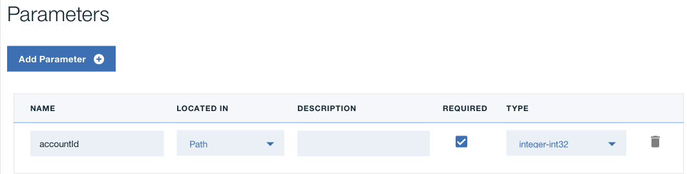

- Create definition

	name : **jsonResponse**

	- Propety :

```
	accountValue   Type String    {“accountValue”: “76628730”}
```
- Add service

	- import wsdl : http://banka.mybluemix.net/services/AccountService?wsdl

- Open Assemble panel

- Remove existing **invoke** policy

- Drag and drop **getBalance** policy

- Edit **getBalance: input**


```
request.paramter.accountId				accountId 
none 							integer
````


- map **getBalance: input**

```	
map property : accountId  with ----> arg0
````


- Edit **getBalance: output**


```

message.body					ouput

application/json    			def/jsonResponse
```

- map **getBalance: output**

```	
map property : return  with ----> accountValue
````
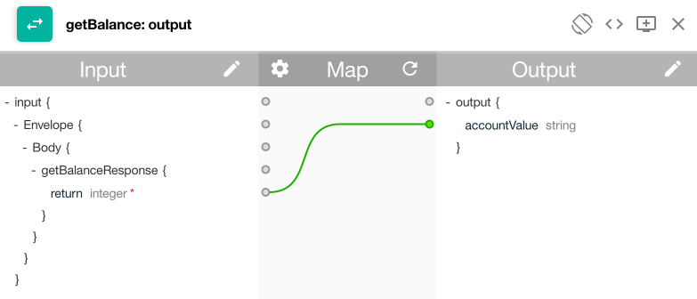

# Test

- Clic on the Test button


- Add API to Product

- Publish product

- Test

***
> 
> Durant cette premiére partie, nous avons montrer les points suivants :
> * Créer une API
> * Intégrer un web service (SOAP) existant
> * Utiliser les composants de mapping de la solution API Connect
> * Créer un produit d'API
> * Tester une API
> 

# Update API

> Dans un deuxiéme temps, nous ajoutons la capacité de retourner la valeur d'une action pour une entreprise donnée. Pour cela nous allons intégrer une API tiers nommé **Quote** et disponible ici : http://dev.markitondemand.com/MODApis/Api/v2/doc 

- In the same API, Add the following Path

```
GET /getquote
```
(expand GET /getquote)

- Add Parameter

```
symbol 	Path	required	string
```
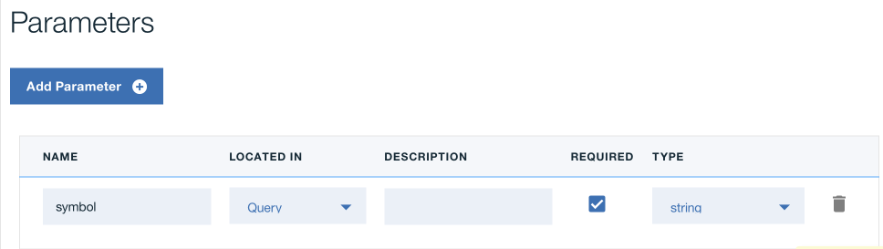

- Clic **Assemblage**

- Add **Condition switch**


- Drag and Drop **invoke** policy for /getquote path

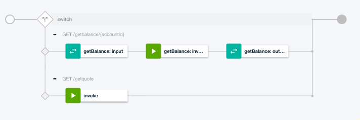

- Update url

http://$(Hostname)/MODApis/Api/v2/Quote?symbol=$(request.parameters.symbol)

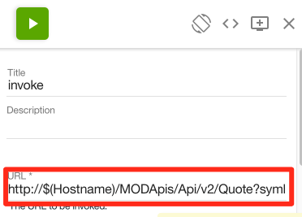

- Go back to **Design** and Add **property**

```
Hostname dev.markitondemand.com
```
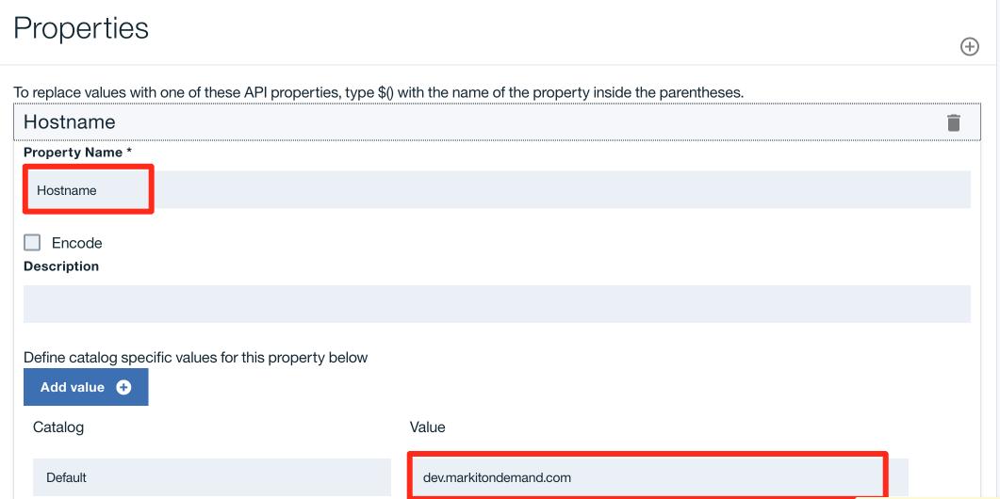

- Save

- Test 


- Republish

- Enter **IBM** for parameter

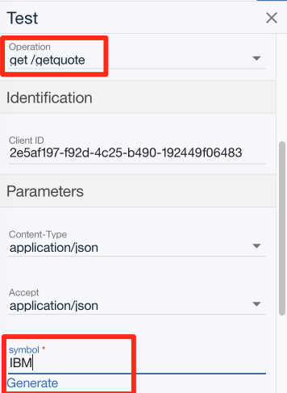

See xml result

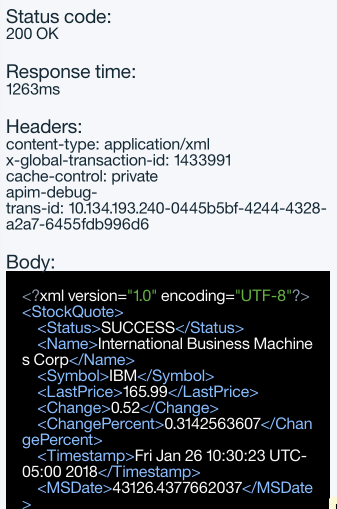

## Add XML to JSON

> Maintenant nous souhaitons retourner la réponse au format JSON plus que XML. Il existe un composant pour cela. Il suffit simplement de faire un Drag & Drop de la politique "XML to JSON"

- Drag and drop "XML to JSON" to getQuote flow


- Save
- Test

***
> 
> Durant cette deuxième partie, nous avons montrer les points suivants :
> * Mise à jours une API
> * Utiliser les composants de routage et de transformation de la solution API Connect
> * Tester une API
> 

# Back to the product

- Define Plan -> Limit 10/1 min with absolut limit

- Publish to Sandbox

- Goto Sanbox

- Move staging to Publish

- Go to Portal  (Montrer d'autre portails)

- Subscribe

- Test in the portal

- Test avec app mobile

- Show Analytic

***
> 
> Durant cette troisième partie, nous avons montrer les points suivants :
> * Définition d'un plan d'API
> * Publication, souscription à une API depuis le portail développeur.
> * Test depuis le Portail développeur.
> * Decouverte de la partie Analytics


Final version of API are available here : [all api] 

[all api]: /apis "Title"


# Micro Service (Optional)

In command line

	apic loopback

	name : **bankms**

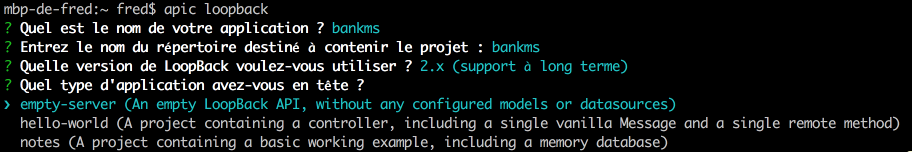

- cd bankms

```
	apic edit
````

- Create datasource


```
db in-memory-db   (stockage) localdb
```
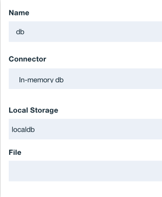

- Create model


```
account

accountId number id
agence number
name string
````
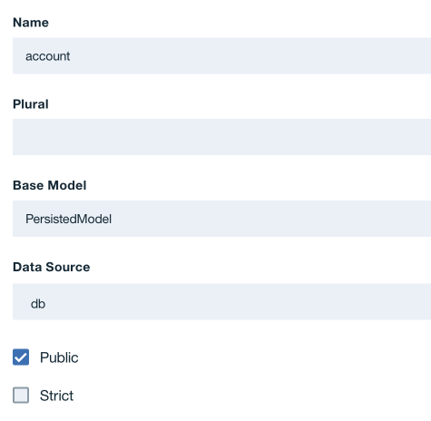
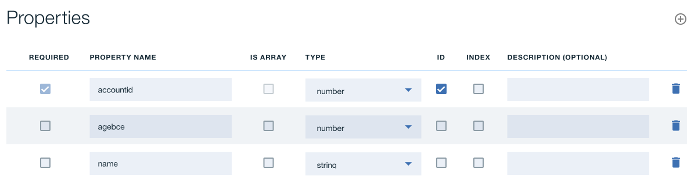

- Start Micro Service


## Test

- Test microservice

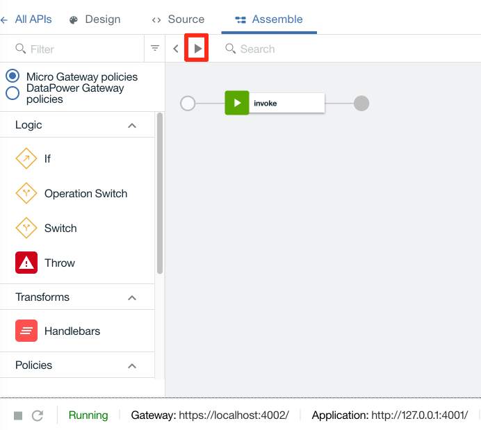

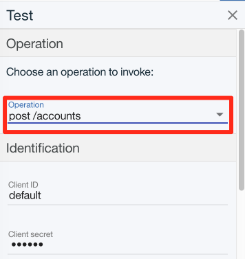
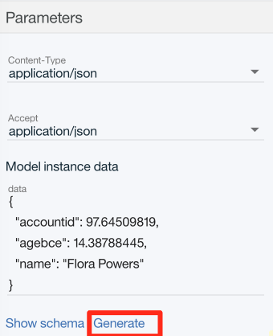

- Post  (Generate)

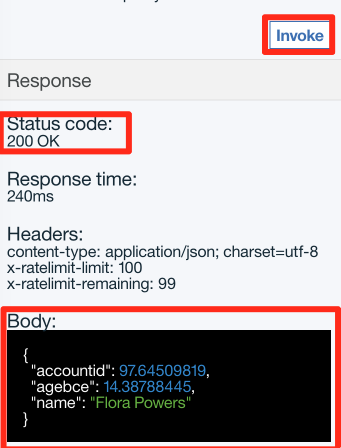

- Get

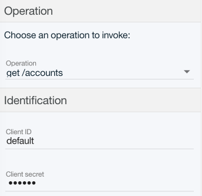
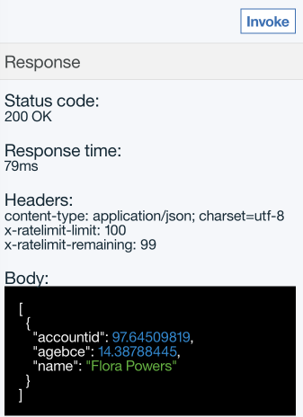


