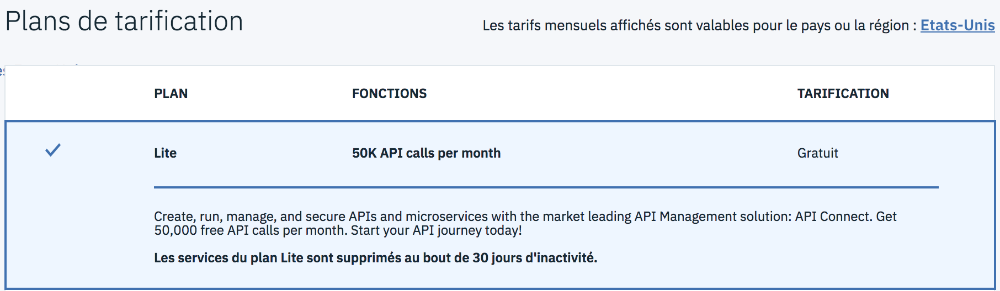

# Technical Workshop : API Connect

## Setup your environnement

## Create an account on IBM Cloud
---

1.  Visit [https://cloud.ibm.com/](https://cloud.ibm.com/) in your web browser.

1.  Press the  `Create a IBM Cloud account` button:
 	
    

1.  Complete the form and press the `Create Account` button.

1.  You will receive an email asking you to confirm your email address. Check your email and click the `Confirm Account` Confirm Account link..

1.  Once confirmed, you will be asked to Log in. Click on the `Log in` link and follow the instructions to enter your credentials and log in. 

 

## Set up your IBM Cloud Organization

1. You will be prompted to **Create organization**. Enter an organization name (notice that there are suggestions for you. Example: acmeOrg). Also select an appropriate region (UK only for Lite plan). Then press the`Create` button.
	
    

1.  Next you will be prompted to **Create space**. Name your space `dev` and click on the `Create` button.

1.  Finally, you will see the Summary page where you can review your entries. Click the `I'm Ready` button.
	
    
    

## Browse the Bluemix Catalog and Attach the APIC Service

1.  In the top right-hand corner of the screen, select the `Catalog` button to browse the list of available Bluemix offerings.

    

1.  Once in the catalog, you can search for the API Connect service by entering in `API Connect` in the search box next to the magnifying glass icon. Click on the `API Connect` Icon to install a new instance of API Connect into your Bluemix space.

    

1.  You can read through some of the details about the service. Select the Lite pricing plan and click on the `Create button.

	
 
1.  Once the API Connect service is attached to your account, you will be automatically launched into the API Drafts screen.

## Create your Developer Portal Instance for your API Connect Catalog 

Now that your API Connect service is up and running, you will set up the consumer-facing Developer Portal for your Sandbox catalog.

1.  From the **Drafts** view, click on the APIC menu and choose the Dashboard option. 

1. Click on your Sandbox Catalog tile.

3. Click on the Settings tab for your Sandbox Catalog.

    

1. Click on the Portal option in the left-hand menu palette.

1. In the **Select Portal** configuration drop-down, select the **IBM Developer Portal** option.

    
    
1. Click the **Save** icon at the top-right corner of the screen.

1. A pop up screen will let you know that the process to create your portal has started.

1. It might take some time for your developer portal to get created, so you do not have to wait for the portal site to be built.

You will receive an email when your portal site is up and ready.

## Continue

Proceed to - [Lab 1 - Exposing a Rest API with API Connect](/twen/labs/lab01.md)

---
##### 2018 - Frederic Dutheil