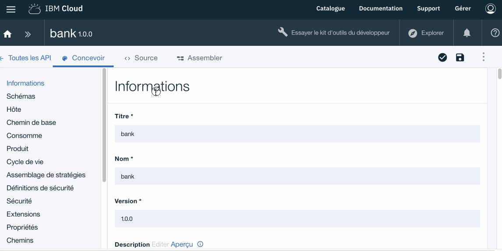

# Technical Workshop : API Connect

## Lab 1 : Exposing a Rest API with API Connect

## Overview 

Imagine that our bank *(Bank A)* already offers REST APIs internally and wants to expose them via an API Management solution.

The purpose of this exercise is to demonstrate how to expose an existing API with API Connect.

> To illustrate this example we will integrate a third-party API named **Quote** and available here: http://dev.markitondemand.com/MODApis/Api/v2/doc

> The **Quote** API proposes to return the current value of an action for the name of a publicly traded company.

```
Quote
http://dev.markitondemand.com/Api/v2/Quote
The Quote method requires the following input parameters

Field	Type	Description
symbol	String	Ticker symbol

When successful, the Quote method returns a serialized StockQuote object.
```


> For this exercise we will work directly in the Sandbox environment of the API Manager on IBM Cloud.


- Open the "Draft" tab in API Manager


## Create a new product : **bankproduct**
---

In the context of API Connect a ** Product ** contains the following information:

* Informations contractuelles	d'usage des APIs
* La visibilité des API pour les développeurs d'application
* Les API disponibles via ce produits d'API
* Les Plans associés. Incluant les notions de quotas et de monétisations des APIs disponibles via ce Produits d'APIs
* Catégories relatives aux APIs de ce Produit.


Clic on ->  **Brouillon** *(Draft)* > **Produits** *(Product)* > **Ajouter** *(Add)* > **Nouveau produit** *(New Product)*

Complete with the values below then click **Create a Product**

Properties       | Value
------------- | -------------
Titre         | bankproduct
Nom			    | bankproduct
Version       | 1.0.0


## Create a new API : **bank**
---

Clic ->  **Brouillon** *(Draft)* > **API** *(API)* > **Ajouter** *(Add)* > **Nouvelle API** *(New API)*

Complete with the values below then click **Create a API**

Properties       | Value
------------- | -------------
Titre         | bank
Nom			    | bank
Chemin de base       | /bank
Version       | 1.0.0


in the tab **Concevoir** *(Design)*

- Add a path **Chemin** *(Path)* named **/getQuote**
- Clic on the icon **+** and complete with the following values :

Properties       | Value
------------- | -------------
Chemin        | getQuote


- Ajouter le **Paramêtre** *(Parameter)* nommé **symbol**

> Remember that in the description of the API the "symbol" parameter must contain the identifier of the company listed on the stock market for which the value of the action is sought.
> http://dev.markitondemand.com/MODApis/Api/v2/doc

Clic ->  **Concevoir** *(Design)* > **Chemins** *(Path)* > **/getQuote** > **Ajouter un nouveau paramêtre** 

- Ajouter un Parametre

Properties       | Value
------------- | -------------
Nom			      | symbol
Situé dans    | requête *(query)*
Requis        | Coché
Type          | String


Once you define the required API elements, you still have to finalize the assembly rules.

API Designer has an assembly view that you can use to create assemblies.
This view contains a palette that lists the different available policies (Logic, Transformation, Security etc ...).

Clic on ->  **Assembler** *(Assemble)*



By default a **invoke** policy is already available. We will just configure it to point to the "Markit On Demand" API used for this example.

Click **Invoke** and copy / paste, in the URL field in the right panel, the url below the * Quote * API of "Markit On Demand"

```
http://dev.markitondemand.com/MODApis/Api/v2/Quote?symbol=$(request.parameters.symbol) 
```


- **Save** by clicking on the icon at the top right


The design in the API is now complete.

## Test your new API: **bank 1.0.0**
---

- Cliquer sur l'icone **Test** pour ouvrir le panneau des outils de test.

 


 Select the **Sandbox** catalog (Selected by default)
- Select the product **bankproduct 1.0.0** (Previously created)
- Click on **Add API** 
- Then **Next**

 

- Click on **Republish the product**
- Select the operation **get getQuote**
- Set **IBM** (or MSFT, AAPL) as the value for *symbol*
- Then click on the **Call** button

The result should have the following form

```
<?xml version="1.0" encoding="UTF-8"?>
<StockQuote>
    <Status>SUCCESS</Status>
    <Name>International Business Machines Corp</Name>
    <Symbol>IBM</Symbol>
    <LastPrice>143.855</LastPrice>
    <Change>-0.055</Change>
    <ChangePercent>-0.0382183309</ChangePercent>
    <Timestamp>Mon May 7 10:27:17 UTC-04:00 2018</Timestamp>
    <MSDate>43227.4356134269</MSDate>
    <MarketCap>132054286640</MarketCap>
    <Volume>667933</Volume>
    <ChangeYTD>153.42</ChangeYTD>
    <ChangePercentYTD>-6.2345196193</ChangePercentYTD>
    <High>144.32</High>
    <Low>143.53</Low>
    <Open>144</Open>
</StockQuote>

```


> If the following message appears click on the link and recomse the operation.
> 
``` 
Code de statut: -1
Aucune réponse reçue. Il se peut que CORS ne soit pas pris en charge sur le serveur cible, que le serveur ne soit pas disponible ou qu'un certificat non digne de confiance ait été rencontré.
Si vous cliquez sur le lien ci-dessous, le serveur s'ouvre dans un nouvel onglet. Si le navigateur affiche un problème lié au certificat, vous pouvez l'accepter et revenir ici pour procéder à de nouveaux tests.
https://api.au.apiconnect.ibmcloud.com/fdutorg-sydneydev/sb/bank/getQuote?symbol=IBM
```

## Add a transformation policy to the API **bank**
---

As we have seen, the format of the message returned by the **Quote** API of "Markit On Demand" is XML or Web or Mobile applications prefer to handle messages in JSON format.

It is very simple with API Connect to transform the XML format to JSON with the transformation policy "XML to JSON"

Open **bank 1.0.0** API

- Click -> **Draft** > **API** > **bank 1.0.0**
- Then click on the **Assemble** tab
- Select in the palette the policy **XML in JSON**
- Then make a Move / Poser policy **XML to JSON** just behind the policy **invoke**
- And that's all ...

 

- **Save**

## Test the API change : **bank 1.0.0**
---

- Cliquer sur l'icone **Test** pour ouvrir le panneau des outils de test.

 


- Click on **Republish the product**
- Select the operation **get getQuote**
- Set **IBM** (or MSFT, AAPL) as the value for *symbol*
- Then click on the **Call** button


The result should have the following form (now in JSON format)

```
{
  "StockQuote": {
    "Status": {
      "$": "SUCCESS"
    },
    "Name": {
      "$": "International Business Machines Corp"
    },
    "Symbol": {
      "$": "IBM"
    },
    "LastPrice": {
      "$": "143.691"
    },
    "Change": {
      "$": "-0.219"
    },
    "ChangePercent": {
      "$": "-0.1521784449"
    },
    "Timestamp": {
      "$": "Mon May 7 11:08:43 UTC-04:00 2018"
    },
    "MSDate": {
      "$": "43227.4643865741"
    },
    "MarketCap": {
      "$": "131903739888"
    },
    "Volume": {
      "$": "1102960"
    },
    "ChangeYTD": {
      "$": "153.42"
    },
    "ChangePercentYTD": {
      "$": "-6.3414157215"
    },
    "High": {
      "$": "144.32"
    },
    "Low": {
      "$": "143.29"
    },
    "Open": {
      "$": "144"
    }
  }
}

play_arrow
invoke
transform
xml-to-json


```


## Summary
---
 
During this exercise we created and tested an API in API Connect.

We also saw how to use policies in the assembly tool.

In the following exercise, we will now see how to publish this API (via its API Product) and how to consume it via a web application.
 
## Continue

Go to - [Lab 2 - Publication and Developer Portal](/tw_en/labs/lab02.md)

---
##### 2018 - Frederic Dutheil