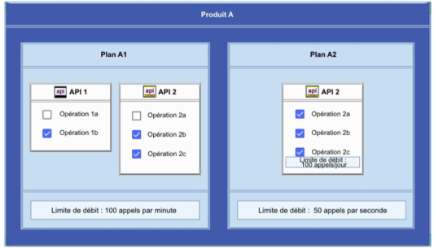
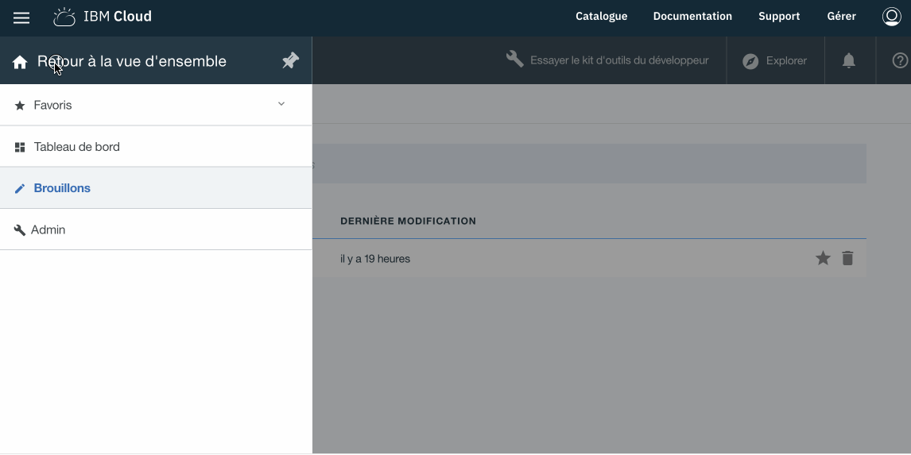
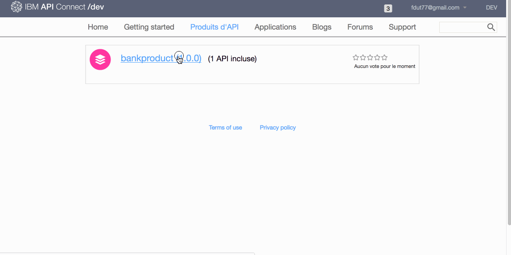

# Technical Workshop : API Connect

## Lab 2 : Publication and Developer Portal

## Overview

> We have created one or more APIs. The goal now is to publish these APIs for later use by third-party applications.

> API Gateway, API Manager and Developer Portal components are involved here.

> - Gateway API exposes APIs to API consumers
> - API Manager Deploys APIs Products on Gateway API and Developer Portal
> - The Portal API allows application developers to subscribe to API Products.
 

## Publication (API Provider)
---

>Pour cet exercice nous allons travailler directement dans l'environnement "Bac à Sable" (Sandbox) de l'API Manager sur IBM Cloud.

- Ouvrir le l'onglet "Brouillon" dans API Manager


### Configure your API Product
---

In the context of API Connect a **Product** contains the following information:

* Contractual information of use of the APIs
Visibility vis-à-vis application developers
* APIs available through this API products
* Associated Plans. Including the concepts of quotas and monetization APIs available through this API Products
* Categories related to the APIs of this Product.



Open API Product ** bankproduct 1.0.0 **

- Click -> **Draft** > **Product** > **bankproduct 1.0.0**

Once the product is open, you can browse all sections of the product and more particularly the sections Visibility, API, Plans.

> To note: A plan is created by default with a **Limits of flow (calls / time interval)** of 100 calls per Hour (with overflow allowed).

We will add a plan

Click the `+ 'button in the ** Plans ** section to add a second plan with the following properties:

> Title: `Premium`
    >
    > Name: `premium`
    >
    > Description: `Accès illimité aux API pour les utilisateurs approuvés`
    >
    > Limites de débit: `Illimité`
    >
    > Approbation: Cocher `Exiger l'approbation de l'abonnement`  
	


- **Save**

As described in the diagram below, the API developer (Provider) develops and publishes APIs. Application Developer (Consumer) subscribes to API Plan to consume APIs from API product.


### Publier un produit d'API dans le catalogue SandBox 
---

> A **catalog** in API Connect represents a set of gateway groups and a developer portal.
> 
It looks like an environment but it also contains a business dimension. For example, the correct names for a catalog are Sandbox, Dev, Integration, Production, CRM (for my CRM API exposed to a specific population), etc ...

- Click -> **Draft** > **Product** > **bankproduct 1.0.0**
- Then click on the icon ** Publication ** (the cloud at the top right) and select the ** Sandbox ** catalog
- At this point the API product is published on the API Manager in **pre-production** state. It is not yet available on the Developer Portal.
- Click on the icon `>>` Then **Dashboard** > **Sandbox**
- Change the status **Pre-production** to **Publish** by clicking on the icon with the 3 vertical points and selecting **Publish**



The API product (which includes the API **bank 1.0.0** and the rules for using the APIs contained in this product) is now published on the Developer Portal and available to API consumers.

## Developer Portal (API Consumer)
---

As an application developer, I want to use the API ** bank 1.0.0 ** from my application.

So ...

- I need to connect to the Developer Portal.

> To know the URL of the Developer Portal: Click on the icon **>>** > **Dashboard** > **Sandbox** > ** Settings ** * (Settings) *> ** Portal **
> 


- In the Developer Portal, click on the menu **API Product**
- The product **bankproduct (1.0.0)** must be visible


To subscribe to an API we need to create a developer account (API Consumer)

- Click on **Create an account** (top right) and fill in the form.

- A message is sent in the mailbox with a link for the activation of the account.

Sample mail

```
De: IBM API Connect <ibmapi@us.ibm.com>

Bonjour,

Merci d'avoir souscrit à l'accès aux API depuis sb.
Pour activer votre compte, cliquez sur le lien suivant :

https://sb-fdutorg-sydneydev.developer.au.apiconnect.ibmcloud.com/?q=ibm_apim/activate/x&activationToken=eyJ1cmwiOiJodHRwczovL2RldmVsb3Blci5hdS5hcGljb25uZWN0LmlibWNsb3VkLmNvbS92MS9wb3J0YWwvdXNlcnMvNWFmMTc3MGEwY2YyM2I5OGJjOTA2YTEyL2FjdGl2YXRlIiwidXNlcm5hbWUiOiIhQkFTRTY0X1NJVl9FTkMhX0FhVDJJSGxZQVBEenE4NHE1VUR3YkdHREtCYUlmei9tSXNEblZ3SXhlUkw0QUFBQUVDRktqcVhyMC8xUDRKWnFua3pPTEU5UHFiVlA5VGhTQ1AyMUgzWFQ4c2xPIiwiYXV0aGVudGljYXRpb24iOnsidXNlcm5hbWUiOiI1YWYwNDVkZjBjZjIzYjk4YmM4ZmIwZWEvNWFmMDQ1ZTAwY2YyM2I5OGJjOGZiMGViL3BIOHFUNW1RMW5IMmRDM3ZOMmtIMXhPMHJWNGVFNWlPOHFFNnlKMWRHNyIsInBhc3N3b3JkIjoianBhR3V5TTNKTlRLRkw4Z1pCZmZlWDVSSllIZHJDcUp3YXNiRTRneDVNIn0sInByb3ZpZGVyQ29udGV4dCI6eyJvcmdJRCI6IjVhZjA0NWRmMGNmMjNiOThiYzhmYjBkZSIsImVudmlyb25tZW50SUQiOiI1YWYwNDVkZjBjZjIzYjk4YmM4ZmIwZWEifX0

```

- Once the account is activated, log in with the developer account.
- Before subscribing to one or more APIs, you must declare an application that consumes APIs.

> When creating the Application, 2 keys are generated: client id and secret client. These 2 keys are very important, they will be required for the API call to which we have subscribed.

> This will identify the consumer application of an API and why not prohibit access if necessary.

- Click on **Create an application** in the menu and fill in the following values:

Propertie       | Value
------------- | -------------
Title         | mobileapp
Description   | une application mobile

- Next **Submit**


||| **IMPORTANT** 
> Copy / Paste the Client Id and Secret Client values into a text editor. These values will be necessary to consume the APIs in the following exercises.

Propertie       | Value
------------- | -------------
client id     | *************
client secret | *************


It is now possible to subscribe to APIs

- Click on ** API Product **
- Then ** bankproduct 1.0.0 **
- Then ** Subscribe ** for the default plan
- Choose the application ** mobileapp ** and click on the button **Subscribe**


We can then test the APIs in the Developer Portal.

- Click in the panel on the left on the API **bank 1.0.0**
- Then on the action **GET / getQuote**
- On the left panel, examples of API calls with different language types are available.
- Go to section **Example of request **
- The **Client ID** has been filled in by default.
- Enter the **symbol** parameter with the ** IBM ** value and click on the **Call an Operation** button

The result should be similar to the previous year (Lab 01)



## Tester you API from a web app.

- go to the url : https://myapicsandbox.eu-de.mybluemix.net/settings

- Enter the required information for the connection

Propertie       | Value
------------- | -------------
Client        | <votre client id>
API Endpoint  | <api endpoint>


You can find your Endpoint API URL via the menu `>>` then **Dashboard** -> **Sandbox** -> **Settings** -> **Gateway**


- Save by clicking on the button **save**
- Go to the URL https://myapicsandbox.eu-de.mybluemix.net/banka

- Test the API **getQuote**


## Summary
---

During this exercise we saw how to publish an API product, subscribe to an API product in the Developer Portal and finally test an API in this same portal.

## Continue

Go to - [Lab 3 - Routing and SOAP Service](/tw_en/labs/lab03.md)


---
##### 2018 - Frederic Dutheil