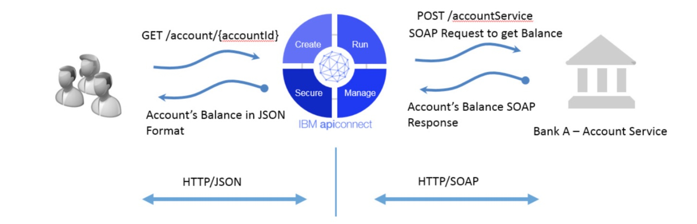
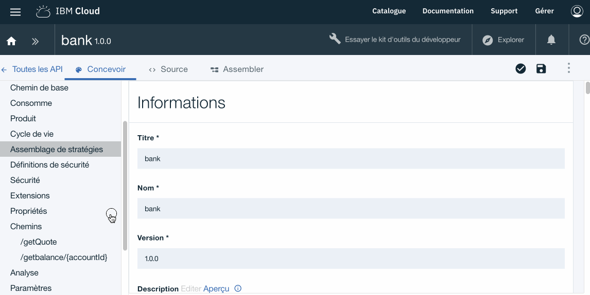
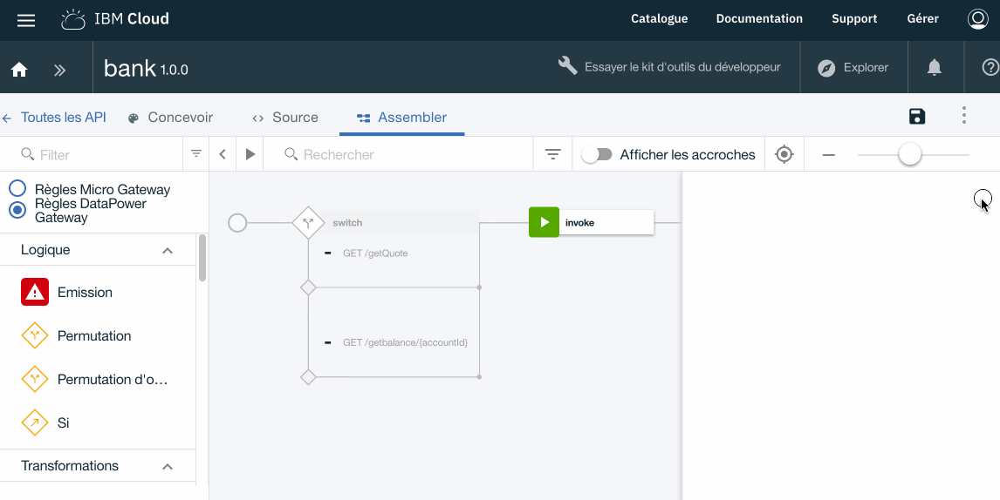

# Technical Workshop : API Connect

## Lab 3 : Routing and SOAP Service 

## Overview 

Bank A has a set of existing SOAP services that it wants to expose via APIs to support its growth in the mobile and web applications market. The Bank A sales team knows that a better presence on mobile and connected devices applications will improve their brand image and increase customer satisfaction.

The Bank A sales team has been given the requirements of its mobile application developers to expose its existing web services as a JSON REST API. JSON payloads are smaller than the same data in SOAP format, which reduces the amount of bandwidth required for mobile applications. JSON is also an easier datum
format for working with JavaScript - a popular programming language for mobile development.

After considering creating its own API management solution, the technology team of Bank A has instead decided to implement a IBM API Management solution, which will allow it to enter the market quickly at a reduced cost.

In this exercise, we will modify the **bank 1.0.0** API to add an operation that solicits an existing Web service.


## Add a Web service 
---

> The purpose of the transaction provided by the web service is to return the balance of a customer account. The accountId is placed in the request path.



- Clic on ->  **Draft** > **API** >  **bank 1.0.0**

Tab **Deign**

- Add a **Path** named **/getBalance/{accountId}**


Properties       | Value
------------- | -------------
Path        | /getbalance/{accountId}


- Add the **Parameter** named **accountId**

> Remember that in the API description the "accountId" parameter must contain the account identifier passed to the web service.

Clic ->  **Design** > **Path** > **/getBalance/{accountId}** > **Add a Parameter** 

- Complete with the following values :

Properties       | Value
------------- | -------------
Name			    | accountId
Situé dans    | Path 
Required        | Coché
Type          | interger-32


> We will then define the output schema for this API by creating a new definition.

- Clic -> **Design** > **Definition** > `+` 

- Complete with the following values :

Properties       | Value
------------- | -------------
Name			    | **jsonResponse**
Type 		    | Object
Propertie     | 
Name           | accountValue
Type          | String
Example       | {“accountValue”: “76628730”}


> We will now create a new service based on the web service

- Clic ->  **Design** > **Services** > **+** 

- Select **Load from a URL**
- Use this url : **http://banka.mybluemix.net/services/AccountService?wsdl**
- Select operation : **AccountService** 
- Next **Finish**
- **Save**




Once defined the elements of the required API it remains to finalize the rules of assembly.

API Designer has an assembly view that you can use to create assemblies.
This view contains a palette that lists the different available policies (Logic, Transformation, Security etc ...).

Clic ->  **Assemble**

We already have an existing assembly defining the stream associated with the path **getQuote** (Lab 01).

To define the flow associated with the ** getBalance ** path, we will use one of the Connect API routing policies.

- Select in the palette the policy ** Permutation **
- Then make a Move / Ask policy ** Permutation ** right in front of the policy **invoke**
- Configure the policy by adding the following parameters:

Propertie       | Value
------------- | -------------
Cas 0			 | /getQuote
Cas 1 		    | /getBalance/{accountId}


- Then move the **invoke** and **XML components to JSON** in the condition / getQuote flow



- Select in the palette the policy **getBalance** (at the very bottom of the list)
- Then make a Move / Ask policy **getBalance** in the flow related to the condition **GET / getBalance / {accountId}**


> We will now edit the input and output properties of the feed **/getBalance**

- Click on the policy **getBalance: input**
- Click on the pencil icon to edit the input parameters **getBalance: input**


- Click on the button `parameter for the operation` then select` get / getBalance / {accountId} `and then the button **Done**

- We have the following values:

```
request.parameter.accountId				accountId 
none 							                integer
```


> We will then associate the values of the query with the input fields required by the web service.

- click on the 'rond' in front of ** accountId ** then on the 'circle' ** arg0 ** (Output side)

```	
map property : accountId  with ----> arg0
```


> We will now associate the output values of the web service with the output fields of the query.


- Click on the policy ** getBalance: ouput **
- Click on the pencil icon to edit the output parameters ** Ouput **


- Click on the `exit 'button for the operation and then select` get / getBalance / {accountId} `

- Then complete with the following value:

```
message.body					ouput

application/json    			def/jsonResponse
```
- Clic on **Finish**


- click on the 'round' in front of the fields **return** (Input side) then on the 'round' **accountValue** (Output side)

```	
map property : return  with ----> accountValue
```


- **Save** by clicking on the icon at the top right 


The web service integration is now complete.

## Test your new API : **bank 1.0.0**
---

- Click on the icon **Test** to open the test tools panel.

 

- Select the **Sandbox** catalog (Selected by default)
- Select the product **bankproduct 1.0.0**
- Click on **Add API**
- Then **Next**

 

- Click on **Republish the product**
- Select the operation **get / getBalance**
- Set a numeric value for the **accountId** parameter
- Then click on the **Call** button

The result should have the following form:

> The result must be equal to the value of the *accountId* +1 parameter

```
Code de statut:
200 OK

Temps de réponse:
2512ms

En-têtes:
content-type: application/json
x-global-transaction-id: 43573929
apim-debug-trans-id: 10.138.25.7-e62f52d5-4a05-43ce-9021-22df7890d3f8

Corps du message:

{
  "accountValue": "13"
}
```
 


## Summary
---

During this exercise, we showed the following points:

- Using Connect API routing capabilities
- How to integrate an existing web service (SOAP)
- Use the mapping components of the API Connect solution
- Test an API


## Continue

Goto - [Lab 4 - Secure an API with OAuth 2.0](/tw_en/labs/lab04.md)


---
##### 2018 - Frederic Dutheil