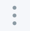

# Technical Workshop : API Connect

## Lab 4 : Secure a API with OAuth 2.0 

## Overview 

In this exercise, we will secure the API **bank 1.0.0** to protect the resources exposed by Bank A. Consumers of the APIs will need to obtain a valid OAuth token before being able to invoke the API **bank**

We will see the following points:

+ How to create an OAuth 2.0 provider
+ How to clone an API to generate a new version.
+ Securing an API via an OAuth 2.0 provider

> We will start by creating an OAuth 2.0 API
>

## Create a OAuth 2.0 provider 
---

Connect API allows to dissociate the security policy from the functional context. Also a developer team can develop the security APIs and another functional APIs.

Click on -> **Draft** > **API** > **Add** > **API du fournisseur OAuth 2.0** 

Complete with the following values and click ** Create **

Propertie       | Value
------------- | -------------
Titre         | oauth
Nom			    | oauth
Path       | /
Version       | 1.0.0

||| IMPORTANT : Check that the value of the base path is correct /

Once in the **Design** tab

- On the left panel, select the heading ** OAuth 2 **
- Complete the following fields:

Propertie | Value
Client type | Confidential

- Scope: Change the scope named **scope1**

Propertie | Value
--------|-------
Name | inventory
Description | Access to Bank A API 

Delete Scope : **scope2** and **scope3**

We want to configure this provider to support only **type agreements Password **

- Uncheck the agreements: Implicit, Application and Access Code

 

In the Identity extraction section, set the Collect credentials using drop-down menu to Basic.

- Dans la section **Extraction d'identité**

Propertie | Value
--------|-------
Collecter les données d'identification avec | **De base**

-In the **Authentication** section, edit the following fields:

Propertie | Value
--------|-------

Authenticate users of the application with | **Authentication URL**
Authentication URL | **https: //thinkibm-services.mybluemix.net/auth**

- **Save** by clicking on the icon at the top right

The design in the OAuth 2 API is now complete.

## Create a new version of the API **bank 1.0.0**
---

- Click on -> ** Draft **> ** API **> **bank 1.0.0**
- In the right corner of the screen, click on the icon

- Select the option: **Save as a new version**

- Enter a new version number like **2.0.0** and click on **Save as new version **

> We now have 2 versions available for the same API.
> The version **bank 1.0.0** will be the unsecured API by OAuth 2.0 and the version **bank 2.0.0** will be the secure API via OAuth 2.0
>

## Apply the OAuth 2.0 security policy for the API **bank 2.0.0**

- Click ->  **Draft** > **API** >  **bank 2.0.0**

- In the **Security Definition** section, click on the **+** to add a new ** OAuth ** definition.

Libéllé | Valeur
--------|-------
Name | **oauth**
Description | **Resource Owner Password Grant Type**
Flow | **Mot de passe**
Token URL | **{Catalog Gateway Endpoint}/oauth2/token**

The token URL will be based on your organization's location and your public IBM Cloud space.

You can find your Gateway Endpoint URL through the menu `>>` then **Dashboard ** -> **Sandbox** -> **Settings** -> **Gateway**

 Locate ENDPOINT, simply copy and paste the content into the Token URL field of your OAuth API settings, then add **/oauth2/token**.

- Add a Scope with the following values:

Propertie | Value
--------|-------
Scope | **inventory**
Description | **Acces aux ressources de Bank A**

- In the **Security** section checked for option 1: **oauth** and scope **inventory **.

- **Save** by clicking on the icon at the top right 

The API **bank 2.0.0** is now secure with OAuth 2.0

## Create a new version of the API product **bankproduct 2.0.0**
---

- Click -> ** Draft ** * (Draft) *> ** Product ** * (Product) *> ** bankproduct 1.0.0 **

- In the right corner of the screen, click on the icon

- Select the option: ** Save as a new version **

- Enter a new version number like ** 2.0.0 ** and click on ** Save as new version **

### API Product Update **bankproduct 2.0.0**

- In the section **API**
- Delete **bank 1.0.0**
- click on **+** and add **bank 2.0.0**, **oauth 1.0.0**
 

- **Save** by clicking on the icon at the top right
- Then **Publish**

We now have 2 API products deployed, bankproduct version 1.0.0 `publish` and bankproduct 2.0.0 in` pre-production`

Menu `>>` then **Dashboard** -> **Sandbox**

We will replace version 1.0.0 with version 2.0.0

For the product **bankproduct 2.0.0**

- cliquer sur l'icone 

- Then select **Replace an existing product**
- Select **bankproduct 1.0.0** then **Next**
- Select plans to **Replace **
- Click on the button **Replace**

At the end of the operation the product ** bankproduct 2.0.0 ** is `Publish` and the product **bankproduct 1.0.0** is` Retired`

We can then test the APIs in the Developer Portal.

- Click on **API Product**
- Then **bankproduct 2.0.0**

It is not necessary to subscribe again because the subscription has been migrated automatically.

- Click in the panel on the right on the API **bank**
- Then on the action **GET / getQuote**
- On the left panel, examples of API calls with different language types are available.
- Go to section **Example of request**
- the **id Client** has been filled in by default.
- It is necessary to inform the **Secret Client** *(Confidential value of the client)* to obtain a valid token
- Fill in the fields **User** and **Password** (user / user)
- Click on the **Allow** button

> If successful a token is returned and will be used to call the action GET / getQuote

- Enter the symbol parameter with the value **IBM** and click on the button **Call an Operation **

## Summary
---

During this exercise, we showed the following points:
 
- Creating a new version of an existing API and product
- Creation of an OAuth 2.0 API
- Securing an API via OAuth 2.0

## Continue

Go to - [Lab 5 - Analytics](/tw_en/labs/lab05.md)

---
##### 2018 - Frederic Dutheil